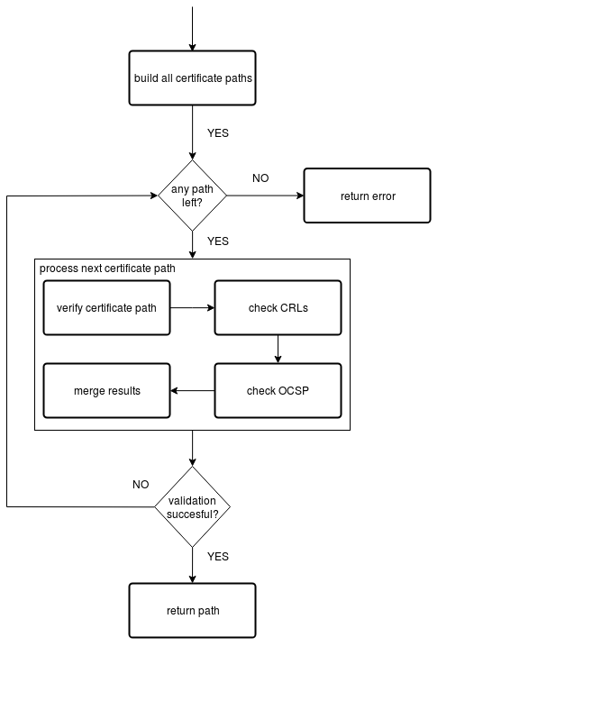

X.509 Certificate Support and Path Validation
=============================================

The following section
describes how Botan performs X.509 certificate path validation, as
defined in [RFC5280]_. It also verifies that Botan is compliant to
the guidelines layed out in [TR-02103]_.

X.509 path validation is implemented in
:srcref:`src/lib/cert/x509/x509path.cpp`. Figure :ref:`x509/path_validation_img` shows how X.509 path validation
is organized.

.. _x509/path_validation_img:

   X.509 Path Validation in Botan.

Certificate Formats Supported by Botan
--------------------------------------

Botan supports X.509 certificates of versions 1 through 3. For X.509v3
certificates it has support for the following extensions. Those include all
extensions that are named as crucial in [TR-02103]_.

* BasicConstraints
* KeyUsage
* SubjectKeyIdentifier
* AuthorityKeyIdentifier
* SubjectAlternativeName
* IssuerAlternativeName
* ExtendedKeyUsage
* NameConstraints
* CertificatePolicies
* AutorityInformationAccess
* CRLDistributionPoints

Unknown extensions are not parsed but their DER encoded content is provided to
the application via the certificate API. [TR-02103]_ provides a separate list of
certificate extensions that might be useful in "some contexts". Only the
"FreshestCRL" extension is not supported by Botan: meaning that delta-CRLs are
not supported either.

Note that the requirements for specific certificate types (i.e. "CA", "TLS Server",
"S/MIME", ..) layed out in [TR-02103]_ are not explicitly enforced during
certificate parsing in Botan. Those checks are performed in the context of
certificate validation or left to the application developer.

Certificate Path Validation Overview
------------------------------------

First, all possible certificate paths are built from the end entity
certificate to a trusted root certificate. As neither the uniqueness of
the issuing certificate's distinguished name nor the uniqueness of its
key identifier can be guaranteed, a certificate's issuing certificate
might not be uniquely defined. Therefore, during path construction all
possible issuers are considered which produces a set of potentially
valid paths to trusted root certificates. Note that the graph induced by
the 'certificate-signed-by-relation' is assumed to be a forest. More
complex structures such as mesh structures and bridge structures as
considered in [RFC4158]_ are not supported.

Candidate paths are validated by checking signatures, validity periods,
key usages and other extensions. Any failures in the validation of each
candidate path are recorded and do not result in an early exit. Instead,
Botan collects all error codes and merges them in the last step. Before,
CRLs and OCSP responses are checked on the candidate path.

The algorithm returns the first candidate path that is validated
successfully. All errors recorded for the candidate paths checked
previously are discarded. If no candidate path can be validated
successfully, the algorithm arbitrarily returns the errors recorded for
the first checked candidate.

**Conclusion:** X.509 path validation is implemented according to the crucial
recommendations of [TR-02103]_. Some extended validation recommendations are not
implemented in the library but can be manually added at application level, if
needed.

.. warning:: OCSP responses are currently vulnerable to spoofing and must not be
   used for certificate revocation status checks. See :ref:`x509/check_ocsp` for
   further details on this vulnerability.

Detailed Description of Path Validation Algorithms
--------------------------------------------------

Botan provides four different variants of the function
``x509_path_validate()`` that differ in the first parameter, either a
single end entity certificate or a certificate chain, and in the third
parameter, either a single ``Certificate_Store`` or a list of
``Certificate_Store`` pointers. The variants taking a single element,
either end entity certificate or ``Certificate_Store`` or both, just
create a list of elements with the one element and then call the variant
of ``x509_path_validate()`` that takes both a certificate chain to
validate and a list of ``Certificate_Store`` pointers. Thus, in the
following, only the variant taking a certificate chain and a list of
``Certificate_Store`` pointers is described in detail.

All variants of ``x509_path_validate()`` take an object of class
``Path_Validation_Restrictions``. This class can be used to enforce
restrictions on path validation, namely the following:

-  Require revocation information, e.g., from CRLs or OCSP
-  Make OCSP requests for all CAs as well as the end entity certificate
   or only for the end entity certificate
-  Maximum age of OCSP responses that do not include the ``next_update``
   field
-  Only allow specific hash functions used in all certificates in the
   chain
-  Require a minimum key strength for all keys in the certificate chain

All variants of ``x509_path_validate()`` take an object of class
``Certificate_Store``. Such a ``Certificate_Store`` is used to store
certificates of trusted parties, e.g., CAs, and CRLs used during path
validation. This store can be curated by the application itself; though, Botan
also supports interfacing with the operating system's certificate trust store.

All variants of ``x509_path_validate()`` return a single object of type
``Path_Validation_Result``. This is tailored to the most common use case
where the path from the end certificate to a trusted root certificate is
uniquely defined. ``Path_Validation_Result`` encapsulates the result of an
X.509 path validation. It stores, amongst other information, the
certificate verification status codes of each certificate in the chain
to be validated. All the status codes can be queried by calling the
``all_statuses()`` member function, while the worst error code can be
retrieved by calling the ``result()`` member function. Moreover, the
subset of status codes that are considered warnings can be queried with
the ``warnings()`` member function. At the time of writing, only the
occurrence of negative certificate serial numbers, distinguished names
that do not adhere to the length limitations and a missing OCSP URL or
unreachable OCSP server produce warnings. To quickly check whether an
X.509 path validation was successful or whether it produced any
warnings, the member functions ``successful_validation()`` and
``no_warnings()`` will return a boolean. All certificate validation status
codes are defined in :srcref:`src/lib/cert/cert_status.h`.

The path validation logic assumes that the end certificate to be checked
is not trusted directly as, in this case, no validation is necessary at
all. More fine-grained policies concerning trusted end certificates can
be built manually using lower-level functions as needed.

.. admonition:: ``x509_path_validate()``

   **Input:**

   -  ``end_certs``: A list of certificates (certificate chain) of size ``n``
      certificates to validate
   -  ``restrictions``: Path validation restrictions
   -  ``trusted_roots``: List of certificate stores that contain trusted
      certificates
   -  ``hostname``: The hostname of the peer (optional)
   -  ``usage``: The usage type of the end entity certificate, one of [TLS
      Server, TLS Client, CA, OCSP Responder, Encryption] (optional)
   -  ``ref_time``: Reference time to use for validation (default: current
      system clock value)
   -  ``ocsp_timeout``: Timeout for OCSP requests in milliseconds (0 means
      OCSP checks disabled; default: 0)
   -  ``ocsp_responses``: Additional OCSP responses to consider

   **Output:**

   -  An object of type ``Path_Validation_Result``

   **Steps:**

   1. If ``end_certs`` is empty, throw an ``InvalidArgument`` exception //
      nothing to validate

   2. Set ``end_entity = end_certs[0]``

   3. Set ``end_entity_extra = end_certs[1] .. end_certs[n-1]``

   4. Set ``path_building_result = build_all_certificate_paths(cert_paths,
      trusted_roots, end_entity, end_entity_extra)``

   5. If (``path_building_result`` != Certificate_Status_Code::OK), then do
      Return Path_Validation_Result(``path_building_result``) // no chain to
      a trusted self-signed root

   6. Set ``error_results`` to an empty vector.

   7. For each ``cert_path`` in ``cert_paths`` do:

      a) Set ``status = check_chain(cert_path, ref_time, hostname, usage,
         restrictions.minimum_key_strength(),
         restrictions.trusted_hashes())`` // check the certificate chain,
         but not rev. data

      b) Set ``crl_status = check_crl(cert_path, trusted_roots, ref_time)``

      c) If (``!oscp_responses.empty()``) then do:

         i. ``ocsp_status = check_ocsp(cert_path, ocsp_resp, trusted_roots,
            ref_time, restrictions.max_ocsp_age())`` // check additional
            OCSP responses

      d) If (``ocsp_status.empty()`` AND ``ocsp_timeout`` != 0) then do:

         i. ``ocsp_status = check_ocsp_online(cert_path, trusted_roots,
            ref_time, ocsp_timeout,
            restrictions.ocsp_all_intermediates())`` // check OCSP using
            online HTTP access

      e) Call ``merge_revocation_status(status, crl_status, ocsp_status,
         restrictions_require_revocation_information(),
         restrictions.ocsp_all_intermediates())`` // merge all revocation
         information

      f) Set ``pvd = Path_Validation_Result(status, cert_path)``

      g) If ``pvd.successful_validation()`` then return ``pvd``

      h) Else append ``pvd`` to ``error_results``.

   8. Return ``error_results[0]``

Function build_all_certificate_paths()
^^^^^^^^^^^^^^^^^^^^^^^^^^^^^^^^^^^^^^

The ``build_all_certificate_paths()`` function tries to build all
possible certificate paths from the end entity certificate given to a
trusted root in one of the trusted certificate stores given. It returns
the certificate paths built and a certificate status code. If at least
one candidate path could be built successfully, the status code will be
``OK``. Otherwise, the first critical error encountered during path
building is returned arbitrarily.

Basically, a DFS is performed starting from the end certificate. A stack
serves to control the DFS. At the beginning of each iteration, a pair is
popped from the stack that contains (1) the next certificate to add to
the path (2) a boolean that indicates if the certificate is part of a
trusted certstore. Ideally, we follow the unique issuer of the current
certificate until a trusted root is reached. However, the issuer's
distinguished name and authority key identifier need not be unique among
the certificates used for building the path. In such a case, we consider
all the matching issuers by pushing <IssuerCert, trusted?> on the stack
for each of them. While executing the DFS, a certificate path is
continuously updated. If a trusted root certificate is reached, the
current certificate path is added to the set of successfully built
paths. To enable backtracking, the stack can also contain deletion
markers. This way, the current certificate path is used a stack as well.

**Conclusion:** This certificate path construction is implemented in accordance
with the path building guidelines in [TR-02103]_. Note however, that Botan depends
on the application to provide all necessary intermediate certificates to build a
valid path. It explicitly *does not* use any information in Certificate Information
Access extensions to fetch additional intermediates from the network.

.. admonition:: ``build_all_certificate_paths()``

   **Input:**

   -  ``cert_paths``: Holds the certificate paths built (output parameter).
   -  ``trusted_certstores``: List of certificate stores that contain trusted
      certificates.
   -  ``end_entity``: The end entity certificate to be validated.
   -  ``end_entity_extra``: An optional list of additional untrusted
      certificates for path building.

   **Output:**

   -  The certificate paths built
   -  A certificate status code: OK if a path could be built, one of
      CANNOT_ESTABLISH_TRUST, CERT_CHAIN_LOOP or CERT_ISSUER_NOT_FOUND,
      otherwise

   **Steps:**

   i.   If the ``end_entity`` certificate is self-signed, Return
        CANNOT_ESTABLISH_TRUST

   ii.  Initialize empty ``certs_seen`` and ``path_so_far``

   iii. Initialize the ``stack`` with ``(end_entity, false)``

   iv.  Load all certificates from ``end_entity_extra`` into a
        CertificateStore ``ee_extras``

   v.   While ``stack`` is not empty do:

        a)  If the top of ``stack`` is a deletion marker then do:

            1) Pop the deletion marker from the ``stack``.
            2) Remove the SHA-256 fingerprint of the last certificate from
               ``path_so_far`` from ``certs_seen``
            3) Pop the last certificate from ``path_so_far``

        b)  Else do:

            1)  Pop ``<last,trusted>`` from the ``stack``
            2)  If ``certs_seen`` contains the SHA-256 fingerprint of ``last``,
                append ``CERT_CHAIN_LOOP`` to stats and return to step v.
            3)  If ``trusted`` and ``last.is_self_signed()``, add ``path_so_far``
                extended by ``last`` to ``cert_paths`` and return to Step v.
            4)  Else if ``not trusted`` and ``last.is_self_signed()``, append
                CANNOT_ESTABLISH_TRUST to ``stats`` and return to Step v.
            5)  Set ``trusted_issuers`` to the set of all certificates that
                match ``last``'s issuer name and issuer authority key
                identifier in ``trusted_certstores``
            6)  Set ``misc_issuers`` to the set of all certificates that
                match ``last``'s issuer name and issuer authority key
                identifier in ``ee_extras``
            7)  If ``trusted_issuers`` and ``misc_issuers`` are empty, append
                CERT_ISSUER_NOT_FOUND to ``stats`` and return to Step v.
            8)  Add ``last``'s SHA-256 fingerprint to ``certs_seen``
            9)  Append ``last`` to ``path_so_far``
            10) Push a deletion marker on the ``stack``
            11) For each ``issuer`` in ``trusted_issuers``, push ``<issuer,true>``
                on the ``stack``
            12) For each ``issuer`` in ``misc_issuers``, push ``<issuer,false>``
                on the ``stack``

Function build_certificate_path()
^^^^^^^^^^^^^^^^^^^^^^^^^^^^^^^^^

The function ``build_certificate_path()`` was not designed to handle
ambiguous paths from an end certificate to a trusted root certificate.
The path validation logic calls the function
``build_all_certificate_paths()`` instead. Since
``build_certificate_path()`` is part of the public API since version 2.0,
it can still be called manually.

The ``build_certificate_path()`` function tries to build a certificate
path from the end entity certificate given to a trusted root in one of
the trusted certificate stores given. It returns the certificate path
built and a certificate status code.

.. admonition:: ``build_certificate_path()``

   **Input:**

   -  ``cert_path``: Holds the certificate path built (output parameter).
   -  ``trusted_certstores``: List of certificate stores that contain trusted
      certificates.
   -  ``end_entity``: The end entity certificate to be validated.
   -  ``end_entity_extra``: An optional list of additional untrusted
      certificates for path building.

   **Output:**

   -  The certificate path built
   -  A certificate status code: OK if path could be built, one of
      CANNOT_ESTABLISH_TRUST, CERT_CHAIN_LOOP or CERT_ISSUER_NOT_FOUND,
      otherwise

   **Steps:**

   1. If the ``end_entity`` certificate is self-signed, Return
      CANNOT_ESTABLISH_TRUST

   2. Append ``end_entity`` to ``cert_path``

   3. Append the SHA-256 fingerprint of ``end_entity`` to ``certs_seen``

   4. Load all certificates from ``end_entity_extra`` into a CertificateStore
      ``ee_extras``

   5. Iterate until we reach a root or cannot find the certificate issuer
      as follows:

      a) Set ``trusted_issuer = false``
      b) Search for the issuer certificate ``issuer`` of the last certificate
         in ``cert_path`` and in all certificate stores in
         ``trusted_certstores``; if found, set ``trusted_issuer = true`` and
         go to the next step
      c) If no issuer certificate was found in the previous step, search
         for the issuer certificate ``issuer`` of the last certificate in
         ``cert_path`` in ``ee_extras``; if not found, Return
         CERT_ISSUER_NOT_FOUND
      d) If ``certs_seen`` contains the SHA-256 fingerprint of ``issuer``,
         Return CERT_CHAIN_LOOP
      e) Append ``issuer``'s SHA-256 fingerprint to ``certs_seen``
      f) Append ``issuer`` to ``cert_path``
      g) If ``issuer`` is self-signed then do: If(``trusted_issuer = true``),
         then do Return OK Else Return CANNOT_ESTABLISH_TRUST

Function check_chain()
^^^^^^^^^^^^^^^^^^^^^^

The ``check_chain()`` function checks the certificate chain given for
validity by walking up the certificate path and checking for validity
period, signatures and extensions, e.g., key usage. It returns a list of
sets of certificate status codes, each entry in the list contains the
status codes for each certificate in the chain.

Note that this function does not validate any revocation information. See
:ref:`x509/check_crl`, :ref: `x509/check_ocsp` and
:ref:`x509/merge_revocation_status` for details on revocation checks.

**Remark:** [TR-02103]_ defines an extended validation involving certificate
policies. Those checks are not implemented in Botan.

**Remark:** [TR-02103]_ discourages the support for X.509 certificates older
than version 3 as they do not have an explicit notion of CA certificates. Botan
supports those legacy versions as trust roots and support cannot be disabled via
the API. If an application wishes to fully drop support for such certificates it
should manually filter the certificates before calling ``x509_path_validate()``.

**Conclusion:** The certificate path validation is implemented in accordance
with the crucial guidelines in [TR-02103]_. This includes the extended validation
of the NameConstraints extension. There is, however, no support for the extended
validation of the CertificatePolicies extension.

.. admonition:: ``check_chain()``

   Input:

   -  ``cert_path``: The certificate chain to check, of size ``n``.
   -  ``ref_time``: The time to perform validation against.
   -  ``hostname``: The hostname to perform validation against.
   -  ``usage``: End entity certificate usage to perform validation against.
   -  ``min_signature_algo_strength``: Minimum strength of signatures in the
      certificate chain, given in symmetric key bits, e.g., 80 allows 1024
      bit RSA and SHA-1, 110 allows 2048 bit RSA and SHA-2, using 128
      requires ECC (P-256) or ~3000 bit RSA keys.
   -  ``trusted_hashes``: a set of trusted hash functions in the certificate
      chain, an empty list means any known hash function is accepted.

   Output:

   -  ``cert_status``: A list of sets of Certificate_Status_Code.

   Steps:

   a) If ``hostname`` is given and ``cert_path[0]`` does not contain a match
      for ``hostname`` according to [RFC6125]_, Append
      Certificate_Status_Codes::CERT_NAME_NOMATCH to ``cert_status[0]`` //
      see function ``matches_dns_name()`` below

   b) If ``usage`` is given and ``cert_path[0]`` does not contain key usage and
      extended key usage bits according to [RFC5280]_, sec. 4.2.1.12, Append
      INVALID_USAGE to ``cert_status[0]``

   c) If ``cert_path[0]`` has basic constraints with a set cA bit, and
      keyCertSign is not set, then, according to [RFC5280]_, sec. 4.2.1.9,
      Append INVALID_USAGE to ``cert_status[0]``

   d) For ``i = 0...n-1`` in ``cert_path`` do:

      1.  Set ``at_self_signed_root = (i == cert_path.size() - 1)`` // last
          certificate in the chain?

      2.  Set ``subject = cert_path[i]``

      3.  If ``at_self_signed_root`` then set ``issuer = cert_path[i]``, else
          set ``issuer = cert_path[i+1]``

      4.  If (``at_self_signed_root = true`` AND ``cert_path[i]`` is not
          self-signed) then do Append ``CHAIN_LACKS_TRUST_ROOT`` to
          ``cert_status[i]``

      5.  If (issuer DN of ``subject`` NOT EQUAL TO subject DN of ``issuer``)
          Append CHAIN_NAME_MISMATCH to *cert_status[i]*

      6.  If ``subject.is_serial_negative()``, Append CERT_SERIAL_NEGATIVE to
          ``cert_status[i]``

      7.  If any component of ``subject``'s distinguished name attributes
          is longer than permitted by [RFC5280]_, Append DN_TOO_LONG to
          ``cert_status[i]``

      8.  If ``validation_time < cert_path[i].not_before()``, Append
          CERT_NOT_YET_VALID to ``cert_status[i]``

      9.  If ``validation_time > cert_path[i].not_after()``, Append
          CERT_HAS_EXPIRED to ``cert_status[i]``

      10. If ``issuer`` does not have the BasicConstraints.CA bit set AND
          ``cert_path`` contains more than one certificate, Append
          CA_CERT_NOT_FOR_CERT_ISSUER to ``cert_status[i]``

      11. If ``subject.signature_algorithm().oid`` is unknown then do Append
          SIGNATURE_ALGORITHM_UNKNOWN to ``cert_status[i]``

      12. If the ``issuer`` public key cannot be loaded from the ``issuer``
          certificate, then do Append CERT_PUBKEY_INVALID to
          ``cert_status[i]`` and continue with step l)

      13. If the signature on ``subject`` can not be verified using
          ``issuer``'s public key, Append the corresponding error to
          ``cert_status[i]``

      14. If ``issuer``'s public key strength < ``min_signature_algo_strength``
          then do Append SIGNATURE_METHOD_TOO_WEAK to ``cert_status[i]``

      15. If (``trusted_hashes`` is not empty AND ``at_self_signed_root =
          false`` AND the hash function used in ``subject`` IS NOT IN
          ``trusted_hashes``) then do Append UNTRUSTED_HASH to
          ``cert_status[i]`` // ignore untrusted hashes on self-signed root
          certs

      16. If (``x509_version`` of ``subject`` is 1 AND
          ``subject`` contains ``v2_issuer_key_id`` OR ``v2_subject_key_id``)
          then do Append V2_IDENTIFIERS_IN_V1_CERT to ``cert_status[i]``.

      17. If ``subjet.cert_version() < 3`` and ``subject.v3_extensions()`` is
          not empty then do Append EXT_IN_V1_V2_CERT to ``cert_status[i]``

      18. Check all other certificate extensions ``ext`` in ``subject``:

          i. ``ext.validate(subject, issuer, cert_path, cert_status, i)`` //
             ``ext`` tries validating itself and modifies ``cert_status`` as
             appropriate

      19. If there ``subject.extensions()`` contains two extensions with
          identical OIDs then do Append DUPLICATE_CERT_EXTENSION

   e) set ``max_path_length = n`` // path length check

   f) From ``i := n - 1`` downto ``1``

      1. If ``cert_path[i].subject_dn() != cert_path[i].issuer_dn()``
         then do

         i. If ``max_path_len > 0`` then do decrement ``max_path_len``, Else
            do Append CERT_CHAIN_TOO_LONG to ``cert_status[i]``

      2. If ``cert_path[i]`` has a path limit then do Set ``max_path_len
         = min(max_path_len, cert_path[i].path_limit())``

   e) Return ``cert_status``

Function host_wildcard_match()
^^^^^^^^^^^^^^^^^^^^^^^^^^^^^^

The function free ``host_wildcard_match()`` checks if a given concrete
hostname matches a hostname containing a wildcard (``*``). [RFC6125]_
allows one wildcard in the left-most label of a hostname.
``host_wilcard_match()`` is called by ``matches_dns_name()`` which will be
discussed subsequently. The separation is inteded to improve readabilty.

For a string ``s = s[0] || … || s[s.size()-1]``, let ``s[i..j]`` be the
substring ``s[i] || … || s[j]``, where ``||`` denotes concatenation.

.. admonition:: ``host_wildcard_match()``

   **Input:**

   -  ``issued``: A hostname that contains a wilcard.
   -  ``name``: The hostname to check.

   **Output:** true, if ``issued`` is a valid hostname, potentially
   containing a wildcard according to [RFC6125]_, and if ``name`` matches
   ``issued``, false otherwise

   **Steps:**

   1.  issued ← lowercase(issued); host ← lowercase(host)

   2.  If ``(host.empty() Or issued.empty())`` then do Return ``false``

   3.  If ``issued`` contains embedded ``'\0'`` characters then do Return
       ``false``

   4.  If ``issued`` contains more than one ``*`` then do Return ``false``

   5.  If ``host`` contains at least one ``*`` then do Return ``false``

   6.  If ``host`` ends with a ``'.'`` character then do Return ``false``

   7.  If ``host`` contains a ``".."`` substring then do Return ``false``

   8.  If ``(issued = host)`` then do Return ``true``

   9.  If ``(issued.size() > host.size() + 1)`` then do Return false \\\\
       ``'*'`` can match the empty string

   10. If issued does not contain exactly one ``*`` character then to Return
       ``false`` \\\\ no exact match here as of 8.

   11. ``dots_seen ← 0; host_idx ← 0`` // match the characters one by one;
       "expand" the single ``*`` in the first component

   12. For ``i = 0..issued.size()-1``

       a) If ``(issued[i] = '.')`` then do ``dots_seen ← dots_seen + 1``

       b) If ``(issued[i] = '*')`` // "expand" ``*``: increment ``host_idx``
          appropriately

          1) If ``(dots_seen > 0)`` then do Return false // ``*`` only allowed
             in leftmost component

          2) ``advance ← (host.size() - issued.size() + 1)`` // we know the
             tail of issued (after the ``*``) and the tail of hostname must
             match

          3) If ``(host_idx + advance > host.size())`` then do Return false

          4) If ``host[host_idx..(host_idx + advance - 1)]`` contains a
             ``'.'`` // do not jump into next component

             1. then do Return ``false``

          5) ``host_idx ← host_idx + advance``

       c) Else

          1) If ``(issued[i] != host[host_idx])`` then do Return ``false``
          2) ``host_idx ← host_idx + 1``

   13. If ``(dots_seen < 2)`` then do Return ``false`` // expect at least 3
       components

   14. return ``true``

Function matches_dns_name()
^^^^^^^^^^^^^^^^^^^^^^^^^^^

The function ``matches_dns_name()`` of class X509_Certificate checks if a
given hostname is present in the certificate's subject distinguished
name, according to [RFC6125]_.

.. admonition:: ``matches_dns_name()``

   **Input:**

   -  ``name``: The hostname to check.

   **Output:** true, if the hostname is present in the subject
   distinguished name, false otherwise

   **Steps:**

   1. If ``name`` is empty, Return false

   2. Set ``issued_names`` = all entries in the *DNS* field of the
      SubjectAlternativeName extension or subject DN

   3. If (``issued_names`` is empty) then do set ``issued_names`` = all entries
      in the *CN* field of subject DN // fall back to CN only if no DNS
      names are set, RFC 6125 sec. 6.4.4

   4. For ``i=0..n`` do:

      a) If (``host_wildcard_match(issued_names[i], name) = true``) then do
         Return ``true``

   5. Return ``false``

**Remark:** Botan checks against the "DNS" field in the SubjectAlternativeName
extension. It does however not support matching "IPAddress" or "URI" fields as
recommended by [TR-02103]_. Applications that rely on such checks must perform
them manually using the provided certificate API.

**Remark:** [TR-02103]_ recommends the prohibition of wildcards for checking
DNS hostnames. Currently, Botan does not provide an API to disable the wildcard
support. Applications can however check for wildcards in the certificate's
subject info and reject it manually, if needed.

.. _x509/check_crl:

Function check_crl()
^^^^^^^^^^^^^^^^^^^^

The ``check_crl()`` function checks certificate revocation lists (CRLs)
for revocation data for the certificates in the given certificate chain
(that was already validated by the ``check_chain()`` function). It returns
a list of sets of certificate status codes, each entry in the list
contains the status codes for each certificate in the chain.

Botan supports some CRL extensions. Namely:

* CRLReasonCode
* CRLNumber
* CRLIssuingDistributionPoint

Note that in the code, two functions ``check_crl()`` are present that call each
other, whereas in the following description, both are combined into one
function for readability.

**Remark:** Botan does neither support indirect CRLs nor delta CRLs. Support for
indirect CRLs is suggested as an "extended validation" in [TR-02103]_. Note that
[RFC5280]_ claims that support for both those CRL types is optional:

..

   Conforming applications are not required to support processing of delta CRLs, indirect CRLs, or CRLs with a scope other than all certificates issued by one
   CA.

**Conclusion:** The implementation is compatible with the crucial recommendations
of [TR-02103]_ for handling certificate revocation checks using CRLs.

.. admonition:: ``check_crl()``

   **Input:**

   -  ``cert_path``: The certificate chain to check, of size ``n``.
   -  ``certstores``: List of certificate stores that contain trusted
      certificates and CRLs.
   -  ``ref_time``: The time to perform validation against.

   **Output:**

   -  ``status``: A list of sets of Certificate_Status_Code.

   **Steps:**

   1. If (``cert_path`` is empty) throw Invalid_Argument exception

   2. If (``certstores`` is empty) throw Invalid_Argument exception

   3. Try to find a CRL for each certificate in ``cert_path`` in each
      certificate store in ``certstores`` and Append them to ``crls``

   4. For ``i=0..n-2`` in ``cert_path`` do:

      a) If ``crls[i]`` does not contain a CRL then do continue with the next
         ``i``
      b) Set ``subject = cert_path[i]``
      c) Set ``ca = cert_path[i+1]``
      d) If ca does not have the CRL_SIGN key usage bit set, Append
         CA_CERT_NOT_FOR_CRL_ISSUER to ``cert_status[i]``
      e) If ``ref_time < crls[i].this_update()``, Append CRL_NOT_YET_VALID
         to ``cert_status[i]``
      f) If ``ref_time > crls[i].next_update()``, Append CRL_HAS_EXPIRED
         to ``cert_status[i]``
      g) If the signature on the ``crls[i]`` cannot be verified with ``ca``'s
         public key, Append CRL_BAD_SIGNATURE to ``cert_status[i]``
      h) Append VALID_CRL_CHECKED to ``cert_status[i]``
      i) If crls[i] lists subject as REVOKED, Append CERT_IS_REVOKED to
         ``cert_status[i]``
      j) If ``subject.crl_distribution_point !=
         crls[i].crl_issuing_distribution_point()`` then do Append
         NO_MATCHING_CRLDP to ``cert_status[i]``
      k) If ``crls[i]`` contains an unknown critical extension then do Append
         CERT_IS_REVOKED to ``cert_status[i]`` // according
         to [ISO-9594-8]_

   5. Remove all empty sets from ``cert_status``

   6. Return ``cert_status``

.. _x509/check_ocsp:

Function check_ocsp()
^^^^^^^^^^^^^^^^^^^^^

The function ``check_ocsp()`` checks the given OCSP responses for a given
certificate chain. It returns a list of sets of certificate status
codes, each entry in the list contains the status codes for each
certificate in the chain.

**Vulnerability:** Botan 3.0.0-alpha1 and previous versions contained a bug in
the OCSP response validation where the authenticity of a spoofed response was not
properly checked. That allowed an attacker to forge OCSP responses for arbitrary
CAs that were considered authentic. That alone had the potential for DOS
attacks. Provided the attacker was in possession of a compromised subject
certificate, they would have been able to circumvent revocation checks and (keep)
impersonating the legitimate certificate owner (if no additional CRL-based
checks are performed).

This vulnerability was assigned CVE-2022-43705. For further details, please refer
to the `associated security advisory in Botan's GitHub repository
<https://github.com/randombit/botan/security/advisories/GHSA-4v9w-qvcq-6q7w>`_ or
the vulnerability description document provided along with this report.

**Conclusion:** With `the given patch <https://github.com/randombit/botan/pull/3067>`_
applied, Botan is no longer vulnerable to the described issue.

Full compliance with the extended OCSP validation rules layed out in [TR-02103]_
requires that authorized OCSP responder certificates that in-turn contain an OCSP
responder in its AuthorityInformationAccess extension to be "recursively" checked
for their revocation status. This functionality is currently not implemented in
Botan.

.. admonition:: ``check_ocsp()``

   **Input:**

   -  ``cert_path``: The certificate chain to check, of size ``n``.
   -  ``ocsp_responses``: OCSP responses to check.
   -  ``certstores``: List of certificate stores that contain trusted
      certificates and CRLs.
   -  ``ref_time``: The time to perform validation against.
   -  ``max_ocsp_age``: maximum age of OCSP responses without ``next_update``.
      0 for no maximum.

   **Output:**

   -  ``cert_status``: A list of sets of Certificate_Status_Code.

   **Steps:**

   1. If (``cert_path`` is empty) throw Invalid_Argument exception

   2. For ``i=0..n-2`` in ``cert_path`` do:

      1. Set ``subject = cert_path[i]``

      2. Set ``ca = cert_path[i+1]``

      3. If ``ocsp_respones[i]`` does not contain an OCSP response, then do
         continue with the next ``i``

      4. Check the signature on the ``ocsp_responses[i]`` by calling
         ``check_signature(trusted_certstores, cert_path)`` on
         ``oscp_responses[i]``

         1. If it returned OCSP_SIGNATURE_OK then do Append the OCSP status
            returned by calling ``status_for(ca, subject, ref_time,
            max_ocsp_age)`` on ``ocsp_responses[i]`` to ``cert_status[i]``
         2. Else Append the return value of ``check_signature()`` to
            ``cert_status[i]``

   3. Remove all empty sets from ``cert_status``

   4. Return ``cert_status``

Function check_signature()
^^^^^^^^^^^^^^^^^^^^^^^^^^

The function ``check_signature()`` of the ``OCSP_Response`` class verifies
the signature on the OCSP response. The issuer's public key is looked up
in the list of trusted certificates in a given list of certificate
stores, in the already validation certificate chain given and last but
not least in the certificate chain as part of the OCSP response. If an
issuer could not be found, the function returns the
OCSP_ISSUER_NOT_FOUND certificate status code. Internally,
``check_signature()`` calls another function ``verify_signature()`` that
performs the actual signature verification using the issuer certificate
found. To improve readability, ``verify_signature()``'s functionality is
specified below as if it was part of ``check_signature()``, starting from
step 7).

.. admonition:: ``OCSP::Response::check_signature()``

   **Input:**

   -  ``trusted_roots``: List of certificate stores that contain trusted
      certificates.
   -  ``ee_cert_path``: The certificate chain validated, of size ``n``.

   **Output:**

   -  A certificate status code.

   **Steps:**

   1. If OCSP issuer's DN is empty and the hash of the OCSP issuer's public
      key is empty then do Return OCSP_RESPONSE_INVALID
   2. Look for the OCSP response's issuer certificate in ``trusted_roots``
      and if found, set ``signing_cert`` to it and continue with step 5)
   3. Look for the OCSP response's issuer certificate in ``ee_cert_path`` and
      if found, set ``signing_cert`` to it and continue with step 5)
   4. Look for the OCSP response's issuer certificate in the optional list
      of certificates sent with the OCSP response and if found, set
      ``signing_cert`` to it and continue with step 5)
   5. If the issuer certificate could not be found eventually, Return
      OCSP_ISSUER_NOT_FOUND
   6. If ``signing_cert``'s key usage does not contain crlSign AND
      ``signing_cert``'s extended key usage does not contain OCSPSigning then
      do Return OCSP_RESPONSE_MISSING_KEYUSAGE
   7. If the signature algorithm sent in the OCSP response does not match
      the signature algorithm in signing_cert's certificate, then do Return
      OCSP_RESPONSE_INVALID
   8. If the signature on the OCSP response cannot be verified using
      signing_cert's public key then do Return OCSP_SIGNATURE_ERROR,
      otherwise Return OCSP_SIGNATURE_OK

Function status_for()
^^^^^^^^^^^^^^^^^^^^^

The function ``status_for()`` of the ``OCSP_Response`` class searches for
the OCSP response for a given issuer and subject certificate and returns
an appropriate OCSP status code.

.. admonition:: ``OCSP::Response::status_for()``

   **Input:**

   -  ``issuer``: The issuer certificate of the OCSP response.
   -  ``subject``: The subject certificate.
   -  ``ref_time``: The time to perform validation against.
   -  ``max_age``: maximum age of OCSP responses without ``next_update``. 0 for
      no maximum.

   **Output:**

   -  An OCSP status code, one of CERT_IS_REVOKED, OCSP_NOT_YET_VALID,
      OCSP_HAS_EXPIRED, OCSP_IS_TOO_OLD, OCSP_RESPONSE_GOOD,
      OCSP_BAD_STATUS or OCSP_CERT_NOT_LISTED.

   **Steps:**

   1. For each SingleResponse in the OCSP response do:

      a) If the SingleResponse is not for ``issuer`` and ``subject``, continue
         with the next response
      b) If the SingleResponse CertStatus is *revoked*, then do Return
         CERT_IS_REVOKED
      c) If the SingleResponse's thisUpdate value > ref_time, then do
         Return OCSP_NOT_YET_VALID
      d) If the SingleResponse contains the nextUpdate field and the
         ref_time > nextUpdate value, then do Return OCSP_HAS_EXPIRED
      e) If the SingleResponse does not contain the nextUpdate field and
         max_age > 0 and (ref_time - thisUpdate value) > max_age, then do
         Return OCSP_IS_TOO_OLD
      f) If the SingleResponse CertStatus is *good*, then do Return
         OCSP_RESPONSE_GOOD
      g) If the SingleResponse CertStatus is *unknown*, then do Return
         OCSP_BAD_STATUS

   2. Return OCSP_CERT_NOT_LISTED

Function check_ocsp_online()
^^^^^^^^^^^^^^^^^^^^^^^^^^^^

The function ``check_ocsp_online()`` checks the OCSP status for a given
certificate chain by making HTTP requests. It returns a list of sets of
certificate status codes, each entry in the list contains the status
codes for each certificate in the chain. Internally, it fetches all OCSP
responses and then passes them to ``check_ocsp()``.

.. admonition:: ``check_ocsp_online()``

   **Input:**

   -  ``cert_path``: The certificate chain to check, of size ``n``.
   -  ``trusted_certstores``: List of certificate stores that contain
      trusted certificates.
   -  ``ref_time``: The time to perform validation against.
   -  ``timeout``: Timeout after which a HTTP request should time out.
   -  ``ocsp_check_intermediate_CAs``: If true also performs OCSP on any
      intermediate certificates, if false only on the end entity
      certificate.
   -  ``max_ocsp_age``: maximum age of OCSP responses without ``next_update``.
      0 for no maximum.

   **Output:**

   -  ``cert_status``: A list of sets of Certificate_Status_Code.

   **Steps:**

   1. If (``cert_path`` is empty) throw Invalid_Argument exception

   2. Set ``to_ocsp = 1``

   3. If (``oscp_check_intermediate_CAs = true``) then do set ``to_ocsp =
      cert_path.size()-1``

   4. If (``cert_path.size() = 1``) then do set ``to_ocsp = 0``

   5. For i=0 ``to_ocsp-1`` do:

      a) Set ``subject = cert_path[i]``

      b) Set ``issuer = cert_path[i+1]``

      c) If subject's OCSP responder field is empty then do:

         i. Append a OCSP response with OCSP_NO_REVOCATION_URL to
            ``ocsp_responses``

      d) If subject's OCSP responder field is not empty then do:

         i. Make a OCSP request via HTTP for ``issuer`` and ``subject`` using
            ``timeout`` and Append the OCSP response to ``ocsp_responses``

   6. Return the value returned by calling ``check_ocsp(cert_path,
      ocsp_responses, trusted_certstores, ref_time, max_ocsp_age)``

.. _x509/merge_revocation_status:

Function merge_revocation_status()
^^^^^^^^^^^^^^^^^^^^^^^^^^^^^^^^^^

The function ``merge_revocation_status()`` merges the results, that is,
the certificate status codes from ``check_chain()``, ``check_crl()``,
``check_ocsp()`` and ``check_ocsp_online()`` into one list of sets of
certificate status codes for the certificate chain validated.

.. admonition:: ``merge_revocation_status()``

   **Input:**

   -  ``chain_status``: Results of a call to ``check_chain()`` (also output
      parameter), of size ``n``.
   -  ``crl_status``: Results of the call to ``check_crl()``.
   -  ``ocsp_status``: Results of the call to ``check_ocsp()``.
   -  ``require_rev_on_end_entity``: Whether a valid CRL or OCSP is required
      for the end entity certificate.
   -  ``require_rev_on_intermediates``: Whether a valid CRL or OCSP is
      required for all intermediate certificates.

   **Output:** None

   **Steps:**

   1. If (``chain_status`` is empty) throw Invalid_Argument exception

   2. For ``i=0..n-2`` do:

      a) Set ``had_crl = false``

      b) Set ``had_ocsp = false``

      c) If ``crl_status[i]`` contains an empty set then do continue with
         step e)

      d) For ``j=0..k-1`` do: // where ``k = crl_status[i].size()``

         i.  If (crl_status[i][j] = VALID_CRL_CHECKED) then do set had_crl
             = true
         ii. Append ``crl_status[i][j]`` to ``chain_status[i]``

      e) If ``ocsp_status[i]`` contains an empty set then do continue with
         step g)

      f) For ``j=0..k-1`` do: // where ``k = ocsp_status[i].size()``

         i.  If (``ocsp_status[i][j]`` in (OCSP_RESPONSE_GOOD,
             OCSP_NO_REVOCATION_URL, OCSP_SERVER_NOT_AVAILABLE)) then do
             set ``had_ocsp = true``
         ii. Append ``ocsp_status[i][j]`` to ``chain_status[i]``

      g) If (``had_crl = false`` AND ``had_ocsp = false``) then do:

         i. If (``require_rev_on_end_entity = true`` AND ``i = 0``) OR
            (``require_rev_on_intermediates = true`` AND ``i > 0``) then do
            Append NO_REVOCATION_DATA to ``chain_status[i]``
