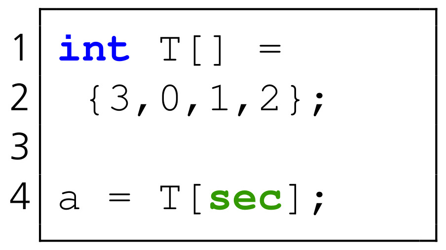
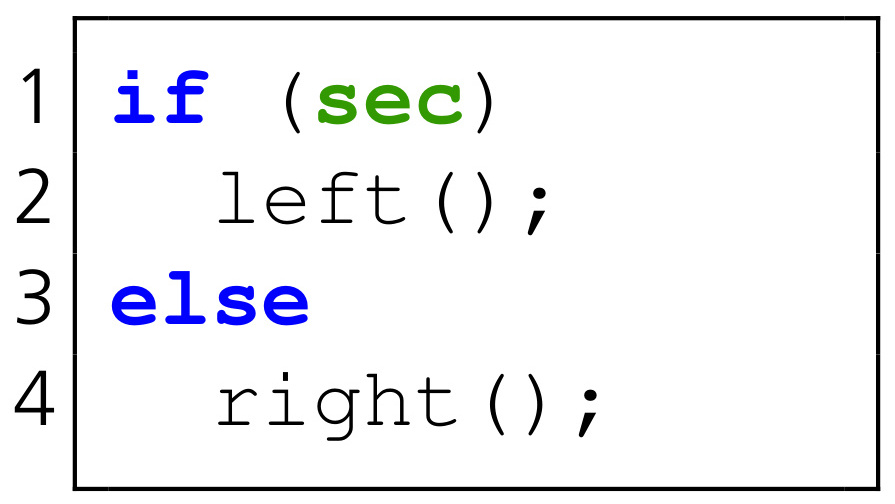

-----------------------------------
Differential Address Trace Analysis
-----------------------------------

DATA is a methodology and framework for the automated detection of programme code in security-critical software that is vulnerable to side-channel attacks.
DATA works with the binary representation of a program as it is actually executed on target systems.
The source code is not needed for the analysis, but is important for the interpretation and for fixing any problems found.
The instructions vulnerable to side-channel attacks are called *leak* and the behaviour of the instructions is called *leakage*.
DATA finds *address-based* leaks, i.e. all control flow and data access operations that are executed depending on secret program inputs.
The following two diagrams illustrate this.

   Leak dependent on data access.

   Leak dependent on control flow.

The variable *sec* is secret, e.g. a cryptographic key or a password.
The first graphic shows a data leak.
This type of leak manifests itself in accesses to memory areas, e.g. look-up tables, depending on secret data.
The second graphic shows a control flow leak.
Here, the execution is changed depending on secret data and, for example, different functions are called.
Data leaks show up in different load/store addresses depending on the input.
Control flow leaks show up in different jump addresses depending on the input and in a change of the instruction pointer.

^^^^^^^^^^^^^^^
Analysis phases
^^^^^^^^^^^^^^^

The analysis with DATA is divided into three phases, which are shown in the following diagram.

.. figure:: img/data-phases.png
   :width: 100%

   Phases of the DATA framework.

**Phase 1.**
The first phase of DATA detects differences in program execution for a given target program.
This target program has at least one input that is to be classified as secret.
For Botan, this is usually the secret cryptographic keys.
The target program is executed and observed using a *Dynamic Binary Instrumentation* (DBI) framework.
In DATA, the DBI framework *Intel Pin* is currently used [INTEL_PIN]_, for which a separate extension, a *Pintool*, has been developed.
During execution, all values of the instruction pointer and, for each instruction, all addresses accessed in read or write mode are recorded chronologically.
This *address trace* is stored as a file for each execution.
The target program is executed several times in phase 1 with different, secret inputs.
At the end, the address traces are compared with each other and differences are determined.
Differences mean that the target program behaves differently for different, secret inputs, i.e. executes different code or accesses different addresses.
Such behaviour is problematic from the perspective of side-channel attacks, as it potentially reveals information about the secret inputs.
For example, if one observes the use of a program's processor cache during execution, different executed functions may show up in different used regions of the cache.
*Constant-time* implementations therefore often try to keep execution uniform regardless of programme inputs.
Any differences between the recorded address traces are stored as a *Point-of-Interest* (POI) in a result file and are the basis for the second phase.

**Phase 2.**
In the second phase of DATA, the target program is again executed and observed in the DBI framework.
However, now only the instructions and associated data accesses that were identified as POIs in the first phase are written.
Phase 2 aims to find real leaks among the POIs and to provide statistical evidence for them.
For this purpose, a *Fixed vs. Random* test methodology is used, which is widely used in the field of side-channel analysis and usually falls under the term *Test Vector Leakage Assessment* (TVLA) [TVLA]_.
In contrast to the Welch's t-test usually used for TVLA, the Kuiper's test is used in DATA because it does not assume normal distributions.
A normal distribution cannot be generally assumed for distributions of accessed or executed memory addresses.
For the test, two groups of executions and associated address traces are created.
For the first group, the target program is executed several times with a fixed, secret input.
For each execution, an address trace is created again, which is added to the *fixed set*.
For the second group, the target program is executed with several, randomly selected, secret inputs.
The address traces created form the *random set*.
For each suspect instruction, i.e. each POI from phase 1, this results in two distributions of observed addresses.
The first distribution of addresses is based on the fixed set, the second distribution on the random set.
If these two distributions can be distinguished, it is in principle possible to infer the secret inputs from the observed addresses.
All instructions for which this distinction is possible represent a side-channel leak and are listed as a problem area in the DATA reports.

**Phase 3.**
In the third phase of DATA, the detected side-channel leaks can be examined in more detail.
For this purpose, a *leakage model* is chosen on the basis of further information, e.g. about the implementation of the examined algorithm or from the scientific literature.
This model derives properties from the secret input of the target programme or divides it into smaller parts, which thus appear in the calculation of the algorithm.
An example of a leakage model is the Hamming weight of the secret input.
Once a model has been chosen, the address traces of the random set from phase 2 or newly generated address traces with random secret inputs are used for the evaluation.
Pairs are formed, consisting of the leakage model applied to the underlying secret input for a trace and the corresponding address of a leak detected in phase 2.
These pairs are formed over all existing traces.
The pairs are then considered as observations of two random processes and the mutual information or *mutual information* between them is estimated.
The *Randomised Dependence Coefficient* (RDC) [RDC]_ is used for this.
If mutual information is detected, it is possible to infer from the observed addresses the property or parts of the secret input calculated using the leakage model.
This can prove which parts or properties of the secret input an attacker can specifically learn through side-channel observations.
This is an important step in better understanding how critical a leak is and what information is revealed in the event of an attack.

**Further informations.**
Further details on the DATA methodology can be found in the scientific publication [DATA]_.
There, for example, the statistical tests and the individual phases are explained in more detail.
Practical results from the analysis of cryptographic software libraries can also be found there.
The DATA framework is described in more detail in the documentation on GitHub [DATA_GIT]_.
It has a modular structure and can be extended in many places as needed.
New programs or software libraries can usually be added easily.
The analysis is automated and scales with the available computing capacities.
The results can be exported automatically as a report and examined in a graphical user interface.

^^^^^^^^^^^^^^^^^^^^^^^^^^^^^^
Interpretation and indications
^^^^^^^^^^^^^^^^^^^^^^^^^^^^^^

Address-based leaks can be exploited through a variety of side-channels.
In the microarchitecture of processors, for example, caches, translation buffers or prediction units for jump addresses can reveal information about accessed addresses.
Memory and coherence connections between processors as well as DRAM accesses can also be the target of attacks, as can memory management functions at operating system level such as paging or memory deduplication.
Since the attack surface is large and difficult to assess, it is recommended to fix all side-channel leaks identified in phase 2 of DATA.
This can be done by modifying the code to eliminate or mitigate the leakage.
Leaks can also be put into the context of how the software is being used and can be included in a risk assessment.
Importantly, each leak represents a potential problem and a possible point of attack.
The analysis results in the following chapters therefore describe all leaks that require a code change or a risk assessment.

The other paragraphs in this chapter deal with specific aspects of the analysis with DATA and serve to understand and classify the results of the analysis.

**Value-based leakage.**
Side-channel attacks based on the power consumption of CMOS electronics are not covered by DATA.
This *value-based* leakage is characterised by the fact that the power consumption and subsequently the electromagnetic radiation are dependent on the data processed in the hardware.
Different data generate different profiles in the measurements, which in turn enables the inference of information about processed data.
There is only an overlap with DATA in that serious dependencies of the execution of secret inputs are, as expected, also visible in such measurements.
These can be, for example, strongly varying execution times.

**Analysis statement.**
The DATA approach has the inherent property that side-channel leaks can be found with a given confidence, but their existence cannot be excluded in principle.
If leaks are found with the help of DATA, this is based on a statistically provable dependency that proves the vulnerability of the code.
False positives are largely avoided by the testing approach in DATA.
If no leaks are found, this only means that no leaks could be found with the analysis parameters used, and not that no leaks exist in general.
This means that false-negative results are quite possible.
This applies in particular to the number of programme executions and associated address traces that form the basis for the analyses.
The fewer executions are observed, the more likely false-negative results are. 
A high number of executions or traces therefore has two significant effects.
On the one hand, more observations lead to clearer results in the statistical tests when leaks are detected.
On the other hand, the number of traces is also a measure of the effort an attacker has to invest in observing a programme in practice.
The greater the number, the greater the effort.
If no leaks are found with a certain number of traces, an attacker would also not learn any statistically relevant information based on the same observations.

**Analysis results.**
The results of DATA show precisely which code has dependencies on secret inputs and must be considered.
This can save considerable effort that would have to be invested, for example, in the context of a manual code review.
However, the results do not show how and with what success a specific point in the code can be exploited or attacked.
Therefore, for identified leaks, it is usually necessary to understand the origin of the dependency and to evaluate the leak.
The leaks listed in this report and the underlying problems have already been analysed and evaluated in this way.

**Comparison to existing tools.**

For the development of Botan, two approaches are currently used to assess the vulnerability of the code to side-channel attacks.
Based on *ctgrind* by Adam Langley [CT_GRIND]_, it is possible in Botan to mark secret programme or function inputs as *uninitialised* [BOTAN_CT_UTILS]_.
The Valgrind tool *Memcheck* [VALGRIND_MEMCHECK]_ is then used to issue warnings when these uninitialised inputs are used for data access or control flow operation.
This approach allows to find data and control flow leaks precisely, but in contrast to DATA, it requires annotations of the source code.
Furthermore, more false positives are produced because uninitialised values also propagate into countermeasures against side-channel attacks, such as *exponent blinding*.
In DATA, this is automatically filtered out, provided the countermeasures achieve the desired effect.
Furthermore, in contrast to DATA Phase 3, this approach cannot determine concrete correlations between data access or control flow and secret inputs.
Another testing approach in the development of Botan is the tool *timing_tests* [BOTAN_TIMING_TEST]_.
It calls certain functions within Botan with different, secret inputs, measures the execution times and writes them to a file.
The measured times are then evaluated visually with the help of the *Mona Timing Report* tool [MONA_TIMING]_.
In contrast to DATA, this approach does not provide statistical evidence of program execution dependencies on secret program or function inputs.

**Note:** For the automated side-channel analyses in this test report, the analysis tool based on *ctgrind* and DATA are used.
DATA is the replacement for the tools *timing_tests* and *Mona Timing Report*.
