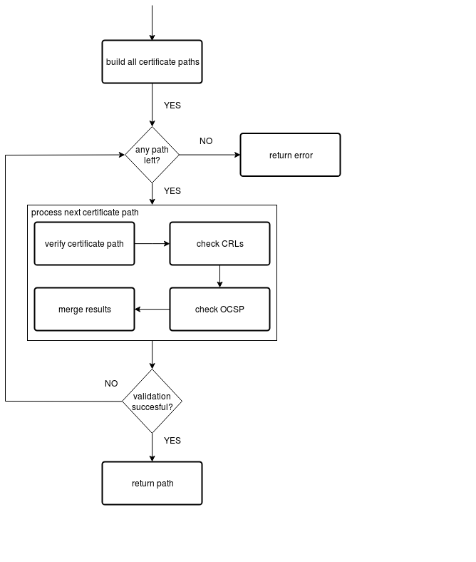

X.509 Certificate Support and Path Validation
=============================================

The following section
describes how Botan performs X.509 certificate path validation, as
defined in [RFC5280]_. It also verifies that Botan is compliant to
the guidelines layed out in [TR-02103]_.

X.509 path validation is implemented in
:srcref:`src/lib/x509/x509path.cpp`. :numref:`x509/path_validation_img` shows how X.509 path validation
is organized.

.. _x509/path_validation_img:

   X.509 Path Validation in Botan.

Certificate Formats Supported by Botan
--------------------------------------

Botan supports X.509 certificates of versions 1 through 3. For X.509v3
certificates it has support for the following extensions. Those include all
extensions that are named as crucial in [TR-02103]_.

* BasicConstraints
* KeyUsage
* SubjectKeyIdentifier
* AuthorityKeyIdentifier
* SubjectAlternativeName
* IssuerAlternativeName
* ExtendedKeyUsage
* NameConstraints
* CertificatePolicies
* AutorityInformationAccess
* CRLDistributionPoints
* OCSP NoCheck (*id-pkix-ocsp-nocheck*, [RFC6960]_)
* NoRevAvail (RFC 9608, since Botan 3.13.0)
* IPAddressBlocks and ASBlocks (RFC 3779)
* TNAuthList (RFC 8226)

Unknown extensions are not parsed but their DER encoded content is provided to
the application via the certificate API. Since Botan 3.13.0, each recognized
extension is bound to the PKIX structures in which it is defined
(``Extension_Context``: certificate, CRL, CRL entry, OCSP request or OCSP
response); an extension appearing in a structure for which it is not
defined (e.g. a CRLNumber extension in a certificate) causes the decoding of
the structure to fail. Likewise, since Botan 3.13.0 a structure containing
two extensions with the same OID is rejected during decoding ([RFC5280]_,
Section 4.2). [TR-02103]_ provides a separate list of
certificate extensions that might be useful in "some contexts". Only the
"FreshestCRL" extension is not supported by Botan: meaning that delta-CRLs are
not supported either. Since Botan 3.12.0, an extension whose OID is
recognized but whose body fails to decode is retained as an unknown
extension and reported with the new status code EXTENSION_ENCODING_ERROR
during path validation (``check_chain()``), regardless of whether the
extension is marked critical.

Since Botan 3.12.0, PKIX structures (certificates, CRLs, certificate
requests and OCSP responses) are decoded with strict DER limits
(``BER_Decoder::Limits::DER()``): non-canonical BER encodings, e.g.
indefinite-length or non-minimal-length encodings, are rejected at parse
time. Furthermore, whether a certificate is considered self-signed is
determined heuristically during parsing (equal subject and issuer
distinguished names and, if both are present, equal subject and
authority key identifiers); the certificate's self-signature is no
longer verified during parsing, but only during path validation.

Botan 3.13.0 further tightened the decoding of PKIX structures:

* Distinguished names are decoded preserving the grouping of attributes
  into relative distinguished names (RDNs). Previously, the RDN
  structure was flattened into a list of attributes, so that the name
  constraint and issuer/subject comparison could not distinguish a
  multi-valued RDN from a sequence of single-valued RDNs
  (CVE-2026-48057). Two distinguished names are compared (function
  ``operator==`` of ``X509_DN``) by their canonical encoding
  (``X509_DN::_canonical_bytes()``): attribute values are compared
  case-insensitively with leading, trailing and repeated whitespace
  removed, and the attributes within an RDN are compared as a set,
  while the order of the RDNs is significant.
* The parameters field of ``AlgorithmIdentifier`` structures in keys
  and signatures is validated against the requirements of the
  respective algorithm (e.g. absent or NULL parameters for RSA keys and
  RSA PKCS #1 v1.5 signatures, a valid ``RSASSA-PSS-params`` structure
  for RSA-PSS signatures, absent parameters for the keys of the
  post-quantum schemes and of Ed25519/Ed448). A public key with
  invalid parameters cannot be loaded (CERT_PUBKEY_INVALID during path
  validation); a signature algorithm identifier with invalid
  parameters is reported with the status code
  SIGNATURE_ALGO_BAD_PARAMS (a hard failure like SIGNATURE_ERROR).
* ASN.1 time values (``ASN1_Time``) are validated at decoding: a
  UTCTime must denote a year between 1950 and 2049, a GeneralizedTime
  a year between 1950 and 9999, and all date and time fields must be in
  range. In OCSP responses, the fields *producedAt*, *thisUpdate*,
  *nextUpdate* and *revocationTime* must be encoded as GeneralizedTime
  as required by [RFC6960]_; a UTCTime in these fields causes the
  response to be rejected.
* The certificate serial number is stored as an explicit type
  ``X509_Serial_Number`` that preserves the sign of the DER INTEGER, so
  that negative serial numbers (reported as the warning
  CERT_SERIAL_NEGATIVE) are no longer conflated with their absolute
  value when serial numbers are compared, e.g. in OCSP responses.
* The signature and public key BIT STRINGs must be octet-aligned (no
  unused bits), and BIT STRINGs representing named bit lists (KeyUsage,
  ReasonFlags) are decoded with the DER rule that trailing zero bits
  must be omitted.
* CRL entries with the reason code *removeFromCRL* (which is only
  defined for delta CRLs) are rejected during CRL parsing. CRL numbers
  larger than 32 bit are supported.

Note that the requirements for specific certificate types (i.e. "CA", "TLS Server",
"S/MIME", ..) layed out in [TR-02103]_ are not explicitly enforced during
certificate parsing in Botan. Those checks are performed in the context of
certificate validation or left to the application developer.

Certificate Path Validation Overview
------------------------------------

Certificate paths are built from the end entity certificate to a
trusted root certificate. As neither the uniqueness of the issuing
certificate's distinguished name nor the uniqueness of its key
identifier can be guaranteed, a certificate's issuing certificate might
not be uniquely defined. Therefore, during path construction all
possible issuers are considered which produces a set of potentially
valid paths to trusted root certificates. Note that the graph induced by
the 'certificate-signed-by-relation' is assumed to be a forest. More
complex structures such as mesh structures and bridge structures as
considered in [RFC4158]_ are not supported. Since Botan 3.12.0, path
building and validation are interleaved: the candidate paths are
enumerated lazily by an internal depth-first search (class
``CertificatePathBuilder``) and each candidate path is validated as soon
as it is discovered, before the search continues.

Candidate paths are validated by checking signatures, validity periods,
key usages and other extensions. Any failures in the validation of each
candidate path are recorded and do not result in an early exit. Instead,
Botan collects all error codes and merges them in the last step.
Afterwards, CRLs and OCSP responses are checked on the candidate path.
Since Botan 3.12.0, these revocation checks are skipped for a candidate
path whose recorded status already contains an error of severity equal
to or above ``FIRST_ERROR_STATUS_TO_SKIP_REVOCATION`` (numeric value
3000), i.e. for chains that are already bound to be rejected.

The algorithm returns the first candidate path that is validated
successfully. All errors recorded for the candidate paths checked
previously are discarded. If no candidate path can be validated
successfully, the algorithm arbitrarily returns the errors recorded for
the first checked candidate. To bound the work performed on maliciously
constructed inputs, since Botan 3.12.0 at most 50 candidate paths and at
most 200 certificate validations are attempted per call; if these limits
are exceeded, the validation fails with the hard-failure status code
``EXCEEDED_SEARCH_LIMITS``. Since Botan 3.13.0, additionally the total
number of depth-first search steps performed during one validation is
bounded by 300 (``PathBuildingDfsBudget``; previously, 1000 steps were
permitted per resumption of the search, so that the total work was not
bounded) and candidate paths longer than 16 certificates
(``PathBuildingMaximumChainLength``) are discarded without being
validated.

**Conclusion:** X.509 path validation is implemented according to the crucial
recommendations of [TR-02103]_. Some extended validation recommendations are not
implemented in the library but can be manually added at application level, if
needed.

Detailed Description of Path Validation Algorithms
--------------------------------------------------

Botan provides four different variants of the function
``x509_path_validate()`` that differ in the first parameter, either a
single end entity certificate or a certificate chain, and in the third
parameter, either a single ``Certificate_Store`` or a list of
``Certificate_Store`` pointers. The variants taking a single element,
either end entity certificate or ``Certificate_Store`` or both, just
create a list of elements with the one element and then call the variant
of ``x509_path_validate()`` that takes both a certificate chain to
validate and a list of ``Certificate_Store`` pointers. Thus, in the
following, only the variant taking a certificate chain and a list of
``Certificate_Store`` pointers is described in detail.

All variants of ``x509_path_validate()`` take an object of class
``Path_Validation_Restrictions``. This class can be used to enforce
restrictions on path validation, namely the following:

-  Require revocation information, e.g., from CRLs or OCSP
-  Make OCSP requests for all CAs as well as the end entity certificate
   or only for the end entity certificate
-  Maximum age of OCSP responses that do not include the ``next_update``
   field (``max_ocsp_age()``; since Botan 3.13.0 the default is seven
   days, previously the age was unbounded by default)
-  Only allow specific hash functions used in all certificates in the
   chain
-  Require a minimum key strength for all keys in the certificate chain
-  Optionally ignore the validity period of the root certificate
-  Require trust anchors to be self-signed
   (``require_self_signed_trust_anchors()``, default: true); if disabled,
   a trusted non-self-signed certificate (e.g. an intermediate CA
   deployed as trust anchor) may terminate a valid path
-  Provide a ``Certificate_Store`` of trusted OCSP responder certificates
   (``trusted_ocsp_responders()``, default: an empty in-memory store);
   see the description of ``check_ocsp()`` below
-  Accept OCSP "soft-fail" conditions (``accept_ocsp_softfail()``,
   since Botan 3.13.0, default: false): if enabled, a missing OCSP
   responder URL, an unreachable OCSP responder or a build without HTTP
   support satisfy the revocation requirement, as it was unconditionally
   the case before Botan 3.13.0; see ``merge_revocation_status()`` below

All variants of ``x509_path_validate()`` take an object of class
``Certificate_Store``. Such a ``Certificate_Store`` is used to store
certificates of trusted parties, e.g., CAs, and CRLs used during path
validation. This store can be curated by the application itself; though, Botan
also supports interfacing with the operating system's certificate trust store.

All variants of ``x509_path_validate()`` return a single object of type
``Path_Validation_Result``. This is tailored to the most common use case
where the path from the end certificate to a trusted root certificate is
uniquely defined. ``Path_Validation_Result`` encapsulates the result of an
X.509 path validation. It stores, amongst other information, the
certificate verification status codes of each certificate in the chain
to be validated. All the status codes can be queried by calling the
``all_statuses()`` member function, while the worst error code can be
retrieved by calling the ``result()`` member function. Moreover, the
subset of status codes that are considered warnings can be queried with
the ``warnings()`` member function. At the time of writing, only the
occurrence of negative certificate serial numbers, distinguished names
that do not adhere to the length limitations, a missing OCSP URL or
unreachable OCSP server, a library built without HTTP support when an
online OCSP check is requested (OCSP_NO_HTTP, a warning since Botan
3.13.0, previously classified as a success code; like the other OCSP
"soft-fail" codes it does not satisfy a revocation requirement unless
``accept_ocsp_softfail()`` is set, so that a required but impossible
online check still fails with NO_REVOCATION_DATA, see
``merge_revocation_status()`` below), and validity-period
violations of the trust root when the restrictions are configured to
ignore them (TRUSTED_CERT_HAS_EXPIRED, TRUSTED_CERT_NOT_YET_VALID)
produce warnings. To quickly check whether an
X.509 path validation was successful or whether it produced any
warnings, the member functions ``successful_validation()`` and
``no_warnings()`` will return a boolean. All certificate validation status
codes are defined in :srcref:`src/lib/x509/pkix_enums.h`.

If the end certificate to be checked is itself contained in one of the
trusted certificate stores, it can constitute a valid candidate path of
length one (provided it is self-signed or self-signed trust anchors are
not required). More fine-grained policies concerning trusted end
certificates can be built manually using lower-level functions as
needed.

.. admonition:: ``x509_path_validate()``

   **Input:**

   -  ``end_certs``: A list of certificates (certificate chain) of size ``n``
      certificates to validate
   -  ``restrictions``: Path validation restrictions
   -  ``trusted_roots``: List of certificate stores that contain trusted
      certificates
   -  ``hostname``: The hostname of the peer (optional)
   -  ``usage``: The usage type of the end entity certificate, one of [TLS
      Server, TLS Client, CA, OCSP Responder, Encryption] (optional)
   -  ``ref_time``: Reference time to use for validation (default: current
      system clock value)
   -  ``ocsp_timeout``: Timeout for OCSP requests in milliseconds (0 means
      OCSP checks disabled; default: 0)
   -  ``ocsp_responses``: Additional OCSP responses to consider

   **Output:**

   -  An object of type ``Path_Validation_Result``

   **Steps:**

   1. If ``end_certs`` is empty, throw an ``InvalidArgument`` exception //
      nothing to validate

   2. Set ``end_entity = end_certs[0]``

   3. Set ``end_entity_extra = end_certs[1] .. end_certs[n-1]``

   4. Initialize an internal ``CertificatePathBuilder`` with
      ``trusted_roots``, ``end_entity``, ``end_entity_extra`` and
      ``require_self_signed =
      restrictions.require_self_signed_trust_anchors()``. The builder
      enumerates the candidate certificate paths lazily using the
      depth-first search described in the following section.

   5. Set ``first_path_error`` to empty, ``paths_checked = 0`` and
      ``certs_checked = 0``.

   6. While the builder yields another candidate path ``cert_path`` do:

      a) If ``cert_path`` contains more than 16 certificates, continue
         with the next candidate path (since Botan 3.13.0)

      b) Increment ``paths_checked`` by one and ``certs_checked`` by the
         number of certificates in ``cert_path``. If (``paths_checked`` >
         50) or (``certs_checked`` > 200), set ``first_path_error =
         Path_Validation_Result(EXCEEDED_SEARCH_LIMITS)`` and exit the
         loop. // bound the search on maliciously constructed inputs

      c) Set ``status = check_chain(cert_path, ref_time, hostname, usage,
         restrictions)`` // check the certificate chain, but not rev. data

      d) If the most severe status code in ``status`` is below
         ``FIRST_ERROR_STATUS_TO_SKIP_REVOCATION`` (3000) then do: //
         revocation checks are skipped on chains that are already
         bound to be rejected

         i.   Set ``crl_status = check_crl(cert_path, trusted_roots,
              ref_time)``

         ii.  If (``!ocsp_responses.empty()``) then do:
              ``ocsp_status = check_ocsp(cert_path, ocsp_responses,
              trusted_roots, ref_time, restrictions)`` // check the
              delivered OCSP responses

         iii. If (``ocsp_timeout`` != 0) then do:

              1. Set ``to_online = n - 1`` (i.e. all certificates except
                 the trust root) if
                 ``restrictions.ocsp_all_intermediates()`` is set,
                 otherwise ``to_online = 1`` (only the end entity
                 certificate) // chain positions that require an OCSP
                 status

              2. Determine whether an online request is needed: for
                 each of the first ``to_online`` chain positions, unless
                 (since Botan 3.13.0) the certificate at that position
                 carries the NoRevAvail or the OCSP NoCheck extension
                 (see RFC 9608, Section 4), check whether its entry in
                 ``ocsp_status`` is empty or
                 missing. If this is the case for at least one position,
                 obtain OCSP responses online by calling
                 ``check_ocsp_online(cert_path, trusted_roots, ref_time,
                 ocsp_timeout, restrictions)`` and copy its results into
                 the *empty* entries of ``ocsp_status`` only; the
                 statuses obtained from the delivered OCSP responses in
                 the previous step are kept. If Botan was built without
                 HTTP support, the status code OCSP_NO_HTTP is inserted
                 into the empty entries instead.

         iv.  Call ``merge_revocation_status(status, crl_status,
              ocsp_status, restrictions)`` // merge all revocation
              information

         v.   Since Botan 3.13.0: for each certificate in ``cert_path``
              except the trust anchor that carries the NoRevAvail
              (RFC 9608) or OCSP NoCheck extension, remove NO_REVOCATION_DATA
              from its status set // no revocation information is
              available for such certificates by definition

      e) Set ``pvd = Path_Validation_Result(status, cert_path)``

      f) If ``pvd.successful_validation()`` then return ``pvd``

      g) Else if ``first_path_error`` is empty, set
         ``first_path_error = pvd``.

   7. If ``first_path_error`` is set, return ``first_path_error`` // at
      least one candidate path was found, but none of them verified

   8. Return ``Path_Validation_Result(builder.error())`` // no path could
      be built at all; the builder reports the first error encountered
      during path building (CERT_CHAIN_LOOP, CANNOT_ESTABLISH_TRUST or
      CERT_ISSUER_NOT_FOUND)

Certificate Path Building (``CertificatePathBuilder``)
^^^^^^^^^^^^^^^^^^^^^^^^^^^^^^^^^^^^^^^^^^^^^^^^^^^^^^

Since Botan 3.12.0, the certificate path building is implemented in the
internal class ``CertificatePathBuilder``, a lazy iterator whose
``next()`` method resumes the search and returns the next discovered
candidate path, or nothing when the search space is exhausted.
``x509_path_validate()`` consumes the candidate paths directly from the
builder (see above). The public API functions
``build_all_certificate_paths()`` and ``build_certificate_path()``
(see below) are wrappers around the same builder.

Basically, a DFS is performed starting from the end certificate. A stack
serves to control the DFS. At the beginning of each iteration, a pair is
popped from the stack that contains (1) the next certificate to add to
the path (2) a boolean that indicates if the certificate is part of a
trusted certstore. Ideally, we follow the unique issuer of the current
certificate until a trusted root is reached. However, the issuer's
distinguished name and authority key identifier need not be unique among
the certificates used for building the path. In such a case, we consider
all the matching issuers by pushing <IssuerCert, trusted?> on the stack
for each of them. While executing the DFS, a certificate path is
continuously updated. If a trusted certificate is reached, the current
certificate path is a candidate path. Note that additional paths could
potentially extend through a trusted, non-self-signed certificate, so
the DFS continues from there. To enable backtracking, the stack can also
contain deletion markers. This way, the current certificate path is used
as a stack as well.

**Conclusion:** This certificate path construction is implemented in accordance
with the path building guidelines in [TR-02103]_. Note however, that Botan depends
on the application to provide all necessary intermediate certificates to build a
valid path. It explicitly *does not* use any information in Certificate Information
Access extensions to fetch additional intermediates from the network.

On construction, the builder receives the trusted certificate stores,
the end entity certificate, the additional untrusted certificates
(``end_entity_extra``) and a flag ``require_self_signed`` indicating
whether only paths ending in a self-signed certificate are to be
yielded. It loads all certificates from ``end_entity_extra`` that are
not already contained in a trusted store into an in-memory certificate
store ``ee_extras``, and initializes the DFS ``stack`` with
``(end_entity, trusted?)``, where ``trusted?`` indicates whether the end
entity certificate itself is contained in one of the trusted stores.
Since Botan 3.13.0, the builder additionally receives a DFS budget
(``dfs_budget``, 300 for all callers) that bounds the total number of
search steps over all calls to ``next()``; before, each call to
``next()`` was allowed up to 1000 steps, so that the total work was
proportional to the number of candidate paths requested.
Errors encountered during the search are recorded; the first recorded
error is reported via ``error()`` if no path is found at all. Each call
to ``next()`` operates as follows:

.. admonition:: ``CertificatePathBuilder::next()``

   **Output:**

   -  The next candidate certificate path, or nothing if the search
      space is exhausted

   **Steps:**

   i.   While ``stack`` is not empty do:

        a)  If ``dfs_budget`` = 0, record CERT_ISSUER_NOT_FOUND as the
            builder error (intentionally overwriting any previously
            recorded error) and Return nothing; otherwise decrement
            ``dfs_budget`` // bound the total work on maliciously
            constructed inputs

        b)  Pop ``<last,trusted>`` from the ``stack``

        c)  If the popped element is a deletion marker then do:

            1) Remove the tag [#tag]_ of the last certificate of
               ``path_so_far`` from ``certs_seen``
            2) Pop the last certificate from ``path_so_far``
            3) Continue with step ii.

        d)  If ``certs_seen`` contains the tag of ``last``, record
            ``CERT_CHAIN_LOOP`` and continue with step ii.

        e)  If ``trusted`` then do:

            1) Set ``path`` = ``path_so_far`` extended by ``last``
            2) Push the issuers of ``last`` for further exploration
               (step g below) // additional paths may extend through a
               trusted, non-self-signed certificate
            3) If ``require_self_signed`` is not set or
               ``last.is_self_signed()``, Return ``path``
            4) Else record CANNOT_ESTABLISH_TRUST (overwriting any
               previously recorded error) and continue with step ii.

        f)  Else if ``last.is_self_signed()``, record
            CANNOT_ESTABLISH_TRUST and continue with step ii. //
            untrusted self-signed certificate terminates the path

        g)  Push the issuers of ``last``:

            1) Set ``trusted_issuers`` to the set of all certificates that
               match ``last``'s issuer name and issuer authority key
               identifier in ``trusted_certstores``
            2) Set ``misc_issuers`` to the set of all certificates that
               match ``last``'s issuer name and issuer authority key
               identifier in ``ee_extras``
            3) If ``trusted_issuers`` and ``misc_issuers`` are empty,
               record CERT_ISSUER_NOT_FOUND and continue with step ii.
            4) Add ``last``'s tag to ``certs_seen``
            5) Append ``last`` to ``path_so_far``
            6) Push a deletion marker on the ``stack``
            7) For each ``issuer`` in ``misc_issuers``, push
               ``<issuer,false>`` on the ``stack``
            8) For each ``issuer`` in ``trusted_issuers``, push
               ``<issuer,true>`` on the ``stack`` // since Botan 3.13.0
               the trusted issuers are pushed last and thus explored
               first, so that the search does not wander through
               cross-signed CAs if the trust anchor issued the
               certificate directly; before, the order was reversed

   ii.  Return nothing // search space exhausted

.. [#tag]
   The certificate tag (``X509_Certificate::Tag``, added in Botan
   3.12.0) wraps the precomputed SHA-256 hash of the certificate data
   and serves as a fast identifier for searching and indexing.

Function build_all_certificate_paths()
^^^^^^^^^^^^^^^^^^^^^^^^^^^^^^^^^^^^^^

The public API function ``build_all_certificate_paths()`` builds all
possible certificate paths from the end entity certificate given to a
trusted certificate in one of the trusted certificate stores given. It
returns the certificate paths built and a certificate status code. It
is implemented by iterating a ``CertificatePathBuilder`` (with
``require_self_signed = false``, i.e. paths ending in trusted
non-self-signed certificates are included) until the search space is
exhausted, collecting all yielded paths. If at least one candidate path
could be built, the status code is ``OK``. Otherwise, the first error
encountered during path building (one of CANNOT_ESTABLISH_TRUST,
CERT_CHAIN_LOOP or CERT_ISSUER_NOT_FOUND) is returned. Note that since
Botan 3.12.0 this function is no longer used by
``x509_path_validate()``, which consumes the builder directly. Since
Botan 3.13.0, both ``build_all_certificate_paths()`` and
``build_certificate_path()`` accept an optional parameter ``max_paths``;
if it is set and the builder yields more candidate paths than
permitted, ``build_all_certificate_paths()`` returns
EXCEEDED_SEARCH_LIMITS, while ``build_certificate_path()`` stops
examining further candidates. In addition, the DFS budget of 300 steps
described above applies to both functions.

Function build_certificate_path()
^^^^^^^^^^^^^^^^^^^^^^^^^^^^^^^^^

The function ``build_certificate_path()`` returns a single certificate
path. It is not used by the path validation logic, which considers all
candidate paths; since ``build_certificate_path()`` is part of the
public API since version 2.0, it can still be called manually.

The ``build_certificate_path()`` function tries to build a certificate
path from the end entity certificate given to a trusted certificate in
one of the trusted certificate stores given. It returns the certificate
path built and a certificate status code.

.. admonition:: ``build_certificate_path()``

   **Input:**

   -  ``cert_path``: Holds the certificate path built (output parameter).
   -  ``trusted_certstores``: List of certificate stores that contain trusted
      certificates.
   -  ``end_entity``: The end entity certificate to be validated.
   -  ``end_entity_extra``: An optional list of additional untrusted
      certificates for path building.
   -  ``max_paths``: An optional bound on the number of candidate paths
      to examine (since Botan 3.13.0; default: unbounded).

   **Output:**

   -  The certificate path built
   -  A certificate status code:

      -  OK, if a path could be built;
      -  EXCEEDED_SEARCH_LIMITS, if ``max_paths`` was passed as 0, in
         which case no path building is attempted at all;
      -  otherwise the error recorded by the ``CertificatePathBuilder``
         while it exhausted the search space without finding a path,
         i.e. one of CANNOT_ESTABLISH_TRUST, CERT_CHAIN_LOOP or
         CERT_ISSUER_NOT_FOUND (the latter is also recorded if the DFS
         budget was exhausted, see above).

   **Steps:**

   1. Initialize a ``CertificatePathBuilder`` with
      ``trusted_certstores``, ``end_entity`` and ``end_entity_extra``
      (with ``require_self_signed = false`` and, since Botan 3.13.0,
      ``dfs_budget = 300``)

   2. While the builder yields another candidate path ``path`` do:

      a) If ``max_paths`` is set and already ``max_paths`` candidate
         paths have been examined, exit the loop (since Botan 3.13.0)

      b) If the last certificate of ``path`` is self-signed, set
         ``cert_path = path`` and Return OK // prefer paths ending in a
         self-signed certificate
      c) Else, if no path has been saved yet, save ``path`` as
         ``first_path``

   3. If a ``first_path`` was saved, set ``cert_path = first_path`` and
      Return OK // a path ending in a trusted, non-self-signed
      certificate is as good as can be formed

   4. Return the first error encountered during path building

Function check_chain()
^^^^^^^^^^^^^^^^^^^^^^

The ``check_chain()`` function checks the certificate chain given for
validity by walking up the certificate path and checking for validity
period, signatures and extensions, e.g., key usage. It returns a list of
sets of certificate status codes, each entry in the list contains the
status codes for each certificate in the chain.

First and foremost this function checks all signatures in the certificate
chain. If any signature cannot be verified, no further checks are made,
as no guarantees can be given about the validity of the certificates anyway.

Note that this function does not validate any revocation information. See
:ref:`x509/check_crl`, :ref: `x509/check_ocsp` and
:ref:`x509/merge_revocation_status` for details on revocation checks.

**Remark:** [TR-02103]_ defines an extended validation involving certificate
policies. Those checks are not implemented in Botan.

**Remark:** [TR-02103]_ discourages the support for X.509 certificates older
than version 3 as they do not have an explicit notion of CA certificates. Botan
supports those legacy versions as trust roots and support cannot be disabled via
the API. If an application wishes to fully drop support for such certificates it
should manually filter the certificates before calling ``x509_path_validate()``.

**Conclusion:** The certificate path validation is implemented in accordance
with the crucial guidelines in [TR-02103]_. This includes the extended validation
of the NameConstraints extension (see :ref:`x509/name_constraints`). There
is, however, no support for the extended validation of the CertificatePolicies
extension.

.. admonition:: ``check_chain()``

   Input:

   -  ``cert_path``: The certificate chain to check, of size ``n``.
   -  ``ref_time``: The time to perform validation against.
   -  ``hostname``: The hostname to perform validation against.
   -  ``usage``: End entity certificate usage to perform validation against.
   -  ``restrictions``: Path validation restrictions.

   Output:

   -  ``cert_status``: A list of sets of Certificate_Status_Code.

   Steps:

   a) For ``i = 0...n-1`` in ``cert_path`` do:

      0. If ``restrictions.require_self_signed_trust_anchors()`` is not
         set and ``cert_path[i]`` is the trust anchor and is not
         self-signed, continue with the next ``i`` // the signature of a
         non-self-signed trust anchor cannot be verified

      1. If ``subject.signature_algorithm().oid`` is unknown then do Append
         SIGNATURE_ALGO_UNKNOWN to ``cert_status[i]`` and continue with
         the next ``i`` // the following sub-steps are only performed for
         known signature algorithms

      2. If the ``issuer`` public key cannot be loaded from the ``issuer``
         certificate, then do Append CERT_PUBKEY_INVALID to
         ``cert_status[i]`` and continue with the next ``i``

      3. If ``issuer``'s public key strength <
         ``restrictions.minimum_key_strength()`` then do Append SIGNATURE_METHOD_TOO_WEAK to
         ``cert_status[i]``

      4. If the signature on ``subject`` can not be verified using
         ``issuer``'s public key, Append the corresponding error to
         ``cert_status[i]`` (SIGNATURE_ERROR; SIGNATURE_ALGO_UNKNOWN if
         no verifier can be instantiated for the signature algorithm;
         since Botan 3.13.0 SIGNATURE_ALGO_BAD_PARAMS if the parameters
         of the signature algorithm identifier are malformed, e.g. an
         invalid ``RSASSA-PSS-params`` structure)

      5. If (``restrictions.trusted_hashes()`` is not empty AND
         ``at_self_signed_root = false`` AND the hash function used in
         ``subject`` IS NOT IN ``restrictions.trusted_hashes()``) then do
         Append UNTRUSTED_HASH to ``cert_status[i]`` // ignore untrusted hashes
         on self-signed root certs

   b) If ``hostname`` is given and ``cert_path[0]`` does not contain a match
      for ``hostname`` according to [RFC6125]_, Append
      Certificate_Status_Codes::CERT_NAME_NOMATCH to ``cert_status[0]`` //
      see function ``matches_dns_name()`` below

   c) If ``usage`` is given and ``cert_path[0]`` does not contain key usage and
      extended key usage bits according to [RFC5280]_, sec. 4.2.1.12, Append
      INVALID_USAGE to ``cert_status[0]``

   d) If ``cert_path[0]`` has basic constraints with a set cA bit, and
      keyCertSign is not set, then, according to [RFC5280]_, sec. 4.2.1.9,
      Append INVALID_USAGE to ``cert_status[0]``

   e) For ``i = 0...n-1`` in ``cert_path`` do:

      1.  Set ``at_self_signed_root = (i == cert_path.size() - 1)`` // last
          certificate in the chain?

      2.  Set ``subject = cert_path[i]``

      3.  Determine the ``issuer`` certificate against which ``subject``
          is checked:

          a) If ``at_self_signed_root`` is false (``subject`` is not the
             last certificate of the chain): set
             ``issuer = cert_path[i+1]``, i.e. the next certificate in
             the chain.

          b) Else, if ``subject`` is self-signed: set
             ``issuer = cert_path[i]``, i.e. the trust anchor is checked
             against itself.

          c) Else (the chain ends in a certificate that is not
             self-signed, which is only possible if the trust anchor
             was accepted as such by the path builder): leave ``issuer``
             unset. The issuer-dependent checks in steps 4, 5 and 10
             below are then skipped or replaced as described there.

      4.  If (``issuer`` is unset AND
          ``restrictions.require_self_signed_trust_anchors()``
          is set (the default)) then do Append ``CHAIN_LACKS_TRUST_ROOT``
          to ``cert_status[i]`` // if non-self-signed trust anchors are
          permitted, a trusted non-self-signed chain end is accepted

      5.  If (``issuer`` is set AND issuer DN of ``subject`` NOT EQUAL TO
          subject DN of ``issuer``) Append CHAIN_NAME_MISMATCH to
          *cert_status[i]*

      6.  If ``subject.is_serial_negative()``, Append CERT_SERIAL_NEGATIVE to
          ``cert_status[i]``

      7.  If any component of ``subject``'s distinguished name attributes
          is longer than permitted by [RFC5280]_, Append DN_TOO_LONG to
          ``cert_status[i]``

      8.  If ``validation_time < cert_path[i].not_before()``, Append
          CERT_NOT_YET_VALID to ``cert_status[i]``, or if we are checking
          a self-signed root cert and the ``restrictions`` allow it, append
          the warning TRUSTED_CERT_NOT_YET_VALID to ``cert_status[i]``

      9.  If ``validation_time > cert_path[i].not_after()``, Append
          CERT_HAS_EXPIRED to ``cert_status[i]``, or if we are checking
          a self-signed root cert and the ``restrictions`` allow it, append
          the warning TRUSTED_CERT_HAS_EXPIRED to ``cert_status[i]``

      10. If ``issuer`` is set AND ``issuer`` is not a CA certificate
          (``is_CA_cert()``: BasicConstraints.cA set and, if a KeyUsage
          extension is present, keyCertSign set) AND ``cert_path``
          contains more than one certificate, Append
          CA_CERT_NOT_FOR_CERT_ISSUER to ``cert_status[i]``

      11. If (``x509_version`` of ``subject`` is 1 AND
          ``subject`` contains ``v2_issuer_key_id`` OR ``v2_subject_key_id``)
          then do Append V2_IDENTIFIERS_IN_V1_CERT to ``cert_status[i]``.

      12. If ``subjet.cert_version() < 3`` and ``subject.v3_extensions()`` is
          not empty then do Append EXT_IN_V1_V2_CERT to ``cert_status[i]``

      13. Check all other certificate extensions ``ext`` in ``subject``:

          i. ``ext.validate(subject, issuer, cert_path, cert_status, i)`` //
             ``ext`` tries validating itself and modifies ``cert_status`` as
             appropriate. Besides the checks of the BasicConstraints,
             KeyUsage, ExtendedKeyUsage and NameConstraints extensions,
             an unrecognized critical extension yields
             UNKNOWN_CRITICAL_EXTENSION, a recognized extension whose
             body failed to decode yields EXTENSION_ENCODING_ERROR, and
             since Botan 3.13.0 an OCSP NoCheck extension in a
             certificate that is not permitted for the usage *OCSP
             Responder* yields INVALID_OCSP_NOCHECK, and a NoRevAvail
             extension (RFC 9608) in a CA certificate or in a
             certificate that also carries a CRLDistributionPoints,
             FreshestCRL or an AuthorityInformationAccess extension
             with an OCSP access method yields NO_REV_AVAIL_INVALID_USE
             (RFC 9608, Section 3).

      14. If there ``subject.extensions()`` contains two extensions with
          identical OIDs then do Append DUPLICATE_CERT_EXTENSION (since
          Botan 3.13.0, this condition cannot occur, as such certificates
          are already rejected during decoding)

   f) set ``max_path_length = n`` // path length check

   g) From ``i := n - 1`` downto ``1``

      1. If ``cert_path[i].subject_dn() != cert_path[i].issuer_dn()``
         then do

         i. If ``max_path_len > 0`` then do decrement ``max_path_len``, Else
            do Append CERT_CHAIN_TOO_LONG to ``cert_status[i]``

      2. If ``cert_path[i]`` has a path limit then do Set ``max_path_len
         = min(max_path_len, cert_path[i].path_limit())``

   h) Return ``cert_status``

.. _x509/name_constraints:

Name Constraints Processing
^^^^^^^^^^^^^^^^^^^^^^^^^^^

The NameConstraints extension ([RFC5280]_, Section 4.2.1.10) is evaluated
during ``check_chain()`` (step e) 13.) by the ``validate()`` member
function of the extension object (class ``Cert_Extension::Name_Constraints``
in :srcref:`src/lib/x509/x509_ext.cpp`); the matching of the individual name
forms is implemented in :srcref:`src/lib/x509/name_constraint.cpp`. This
section describes to which extent this processing fulfills the requirements
of [RFC5280]_, Sections 4.2.1.10 and 6.1.4.

**Scope of application.** The constraints of a CA certificate are applied to
the subject distinguished name (if non-empty) and to all names in the
SubjectAlternativeName extension of every subsequent certificate in the
path, as required by [RFC5280]_, Section 6.1.4 (g). Self-issued
intermediate certificates are exempt, while a self-issued end entity
certificate is subject to the constraints ([RFC5280]_, Section 6.1.3 (b)).
Rather than maintaining the *permitted_subtrees* and *excluded_subtrees*
state variables of the RFC's path processing algorithm, Botan evaluates
the constraints of each CA certificate separately against all of its
subordinate certificates and requires that every applicable name is
permitted by each of these constraint sets and excluded by none. This is
equivalent to the intersection of the permitted subtrees and the union of
the excluded subtrees prescribed by the RFC. A NameConstraints extension in
a certificate that is not a CA certificate is reported as an error
(NAME_CONSTRAINT_ERROR), as is any violation of a constraint.

**Supported name forms.** [RFC5280]_ requires conforming implementations to
process constraints of the *directoryName* form and recommends processing
of the *rfc822Name*, *uniformResourceIdentifier*, *dNSName* and
*iPAddress* forms. Botan processes all five forms and, in addition, the
*SmtpUTF8Mailbox* other-name form of RFC 9598 under the *rfc822Name*
constraints. Support for the *rfc822Name* and *uniformResourceIdentifier*
forms was added in Botan 3.13.0. For any other name form (e.g.
*x400Address*, *ediPartyName*, *registeredID*, and *otherName* types other
than *SmtpUTF8Mailbox*), Botan follows the rule of [RFC5280]_,
Section 4.2.1.10 for constraints it cannot process: if the extension is
marked critical and a subsequent certificate contains a name of that form,
the certificate is rejected; if the extension is not critical, such
constraints are ignored.

**Semantics of the individual name forms.**

-  *directoryName*: a name is matched if the constraint's RDN sequence is
   a prefix of the name's RDN sequence, with the attribute values compared
   according to the rules of [RFC5280]_, Section 7.1 (case-insensitive,
   with leading, trailing and repeated whitespace removed). Since Botan
   3.13.0 the comparison respects the grouping of attributes into RDNs; in
   earlier versions the RDN structure was flattened, which allowed a
   constraint to be circumvented by regrouping the attributes
   (CVE-2026-48057).
-  *dNSName*: a constraint of the form ``host.example.com`` is satisfied by
   the host itself and by any name formed by prepending labels, as
   specified in the RFC. As an extension beyond the RFC, a constraint with
   a leading dot (``.example.com``) is accepted and matches proper
   subdomains only. Label comparison is case-insensitive.
-  *iPAddress*: constraints are interpreted as address and mask in CIDR
   style as required by the RFC, for IPv4 and (since Botan 3.12.0) IPv6.
   Botan is stricter than the RFC's encoding rule in that a mask which is
   not a contiguous prefix causes the extension to fail decoding.
-  *rfc822Name*: the three constraint forms of the RFC are supported: a
   particular mailbox (``user@example.com``), all mailboxes at a host
   (``example.com``) and all mailboxes in a domain (``.example.com``). As
   required by the RFC, if a certificate has no SubjectAlternativeName
   extension, the constraints are applied to the *emailAddress* attributes
   of the subject distinguished name.
-  *uniformResourceIdentifier*: the constraint is applied to the host part
   of the URI, with the host and domain forms (with and without leading
   dot) as specified in the RFC. A URI in a subsequent certificate whose
   authority component does not contain a fully qualified domain name (an
   IP address literal or a missing authority) leads to the rejection of the
   certificate whenever a URI constraint is in effect, as required by the
   RFC.

**Extensions beyond RFC 5280.** If a certificate has no
SubjectAlternativeName extension, Botan additionally subjects those *CN*
attributes of the subject distinguished name that parse as an IPv4 address
or as a DNS name containing a dot to the *iPAddress* and *dNSName*
constraints, mirroring the fallback to the common name in host name
verification. A wildcard *dNSName* entry (``*.example.com``) is treated as
excluded if any of its possible expansions falls into an excluded subtree.
Both measures only make the processing stricter.

**Restrictions and deviations.** The *minimum* field of a *GeneralSubtree*
must be zero and the *maximum* field must be absent, as mandated by the
RFC; the extension fails to decode otherwise. To bound the work on
maliciously constructed inputs, a certificate is rejected if the product of
its number of names and the number of constraints exceeds 2\ :sup:`16`;
this is an implementation limit not foreseen by the RFC, which only affects
certificates of implausible size. The *otherName* constraint forms defined
outside RFC 5280 (e.g. SRVName of RFC 4985 or Microsoft's user principal
name) are not processed; as described above, they lead to rejection only
if the extension is critical.

Function host_wildcard_match()
^^^^^^^^^^^^^^^^^^^^^^^^^^^^^^

The function ``host_wildcard_match()`` (since Botan 3.13.0 a static
member function of the class ``DNSName`` in
:srcref:`src/lib/utils/dns_name/dns_name.cpp`, previously a free
function) checks if a given concrete hostname matches a hostname
possibly containing a wildcard (``*``). [RFC6125]_ allows one wildcard
in the left-most label of a hostname. All character comparisons in the
function are case-insensitive for ASCII letters. ``host_wildcard_match()`` is
called by ``matches_dns_name()`` which will be discussed subsequently.
The separation is intended to improve readability.

For a string ``s = s[0] || … || s[s.size()-1]``, let ``s[i..j]`` be the
substring ``s[i] || … || s[j]``, where ``||`` denotes concatenation.

.. admonition:: ``host_wildcard_match()``

   **Input:**

   -  ``issued``: A hostname that may contain a wildcard.
   -  ``host``: The hostname to check.

   **Output:** true, if ``issued`` is a valid hostname, potentially
   containing a wildcard according to [RFC6125]_, and if ``host`` matches
   ``issued``, false otherwise

   **Steps:**

   1.  If ``(host.empty() Or issued.empty())`` then do Return ``false``

   2.  If ``host.size() > 253`` then do Return ``false`` // maximum
       length of a DNS name (since Botan 3.13.0)

   3.  If ``issued`` or ``host`` contains embedded ``'\0'`` characters
       then do Return ``false``

   4.  If ``issued`` contains more than one ``*`` then do Return ``false``

   5.  If ``host`` contains at least one ``*`` then do Return ``false``

   6.  If ``host`` ends with a ``'.'`` character then do Return ``false``

   7.  If ``host`` contains a ``".."`` substring then do Return ``false``

   8.  If ``(issued = host)`` then do Return ``true``

   9.  If ``(issued.size() > host.size() + 1)`` then do Return false \\\\
       ``'*'`` can match the empty string

   10. If issued does not contain exactly one ``*`` character then to Return
       ``false`` \\\\ no exact match here as of 8.

   11. Since Botan 3.13.0: If the left-most label of ``issued`` starts
       with ``xn--``, or if the left-most label of ``issued`` is not
       exactly ``*`` and the left-most label of ``host`` starts with
       ``xn--``, then do Return ``false`` // no wildcard matching within
       internationalized (A-label) domain labels, [RFC6125]_, Section
       6.4.3

   12. ``dots_seen ← 0; host_idx ← 0`` // match the characters one by one;
       "expand" the single ``*`` in the first component

   13. For ``i = 0..issued.size()-1``

       a) If ``(issued[i] = '.')`` then do ``dots_seen ← dots_seen + 1``

       b) If ``(issued[i] = '*')`` // "expand" ``*``: increment ``host_idx``
          appropriately

          1) If ``(dots_seen > 0)`` then do Return false // ``*`` only allowed
             in leftmost component

          2) ``advance ← (host.size() - issued.size() + 1)`` // we know the
             tail of issued (after the ``*``) and the tail of hostname must
             match

          3) If ``(host_idx + advance > host.size())`` then do Return false

          4) If ``host[host_idx..(host_idx + advance - 1)]`` contains a
             ``'.'`` // do not jump into next component

             1. then do Return ``false``

          5) ``host_idx ← host_idx + advance``

       c) Else

          1) If ``(issued[i] != host[host_idx])`` then do Return ``false``
          2) ``host_idx ← host_idx + 1``

   14. If ``(dots_seen < 2)`` then do Return ``false`` // expect at least 3
       components

   15. return ``true``

Function matches_dns_name()
^^^^^^^^^^^^^^^^^^^^^^^^^^^

The function ``matches_dns_name()`` of class X509_Certificate checks if a
given hostname is present in the certificate's subject distinguished
name, according to [RFC6125]_.

.. admonition:: ``matches_dns_name()``

   **Input:**

   -  ``name``: The hostname to check.

   **Output:** true, if the hostname is present in the subject
   distinguished name, false otherwise

   **Steps:**

   1. If ``name`` is empty, Return false

   2. If ``name`` parses as an IPv4 or IPv6 address (the latter since
      Botan 3.12.0), Return true if the address equals one of the
      *iPAddress* entries of the SubjectAlternativeName extension, false
      otherwise

   3. Since Botan 3.13.0: If ``name`` does not parse as a valid DNS
      name (``DNSName::from_string()``: at most 253 characters, labels
      of at most 63 characters consisting of ASCII letters, digits and
      non-leading/non-trailing hyphens, no empty labels, not entirely
      numeric, no ``*``), Return ``false``. Otherwise, continue with
      the lowercased canonical form of ``name``.

   4. Set ``issued_names`` = all entries in the *DNS* field of the
      SubjectAlternativeName extension

   5. If no subject alternative names extension is available then do set
      ``issued_names`` = all entries in the *CN* field of subject DN // fall
      back to CN only if no DNS names are set, RFC 6125 sec. 6.4.4. Since
      Botan 3.13.0, only CN values that parse as a valid DNS name
      (``DNSName::from_san_string()``, which additionally permits a
      single ``*`` in the left-most label of a name with at least three
      labels, not within an ``xn--`` label) are considered.

   6. For ``i=0..n`` do:

      a) If (``host_wildcard_match(issued_names[i], name) = true``) then do
         Return ``true``

   7. Return ``false``

**Remark:** Botan checks against the "DNS" field in the SubjectAlternativeName
extension. If the name to match parses as an IPv4 address, it is instead
matched against the "IPAddress" (iPAddress) entries of the
SubjectAlternativeName extension; since Botan 3.12.0 this also applies
to IPv6 addresses. Matching "URI" fields as recommended by [TR-02103]_
is not supported. Applications that rely on such checks must perform
them manually using the provided certificate API.

**Remark:** [TR-02103]_ recommends the prohibition of wildcards for checking
DNS hostnames. Currently, Botan does not provide an API to disable the wildcard
support. Applications can however check for wildcards in the certificate's
subject info and reject it manually, if needed.

.. _x509/check_crl:

Function check_crl()
^^^^^^^^^^^^^^^^^^^^

The ``check_crl()`` function checks certificate revocation lists (CRLs)
for revocation data for the certificates in the given certificate chain
(that was already validated by the ``check_chain()`` function). It returns
a list of sets of certificate status codes, each entry in the list
contains the status codes for each certificate in the chain.

Botan supports some CRL extensions. Namely:

* CRLReasonCode
* CRLNumber
* CRLIssuingDistributionPoint

Note that in the code, two functions ``check_crl()`` are present that call each
other, whereas in the following description, both are combined into one
function for readability.

Since Botan 3.13.0, before a CRL found for a certificate is used, its
applicability to the certificate is determined according to [RFC5280]_,
Section 6.3.3 (b) (internal function ``crl_applicability_for()``): the
CRL must match one of the certificate's distribution points (or, if
the certificate has no CRLDistributionPoints extension, the implicit
distribution point consisting of the certificate issuer's name, see
:ref:`the distribution point matching <x509/dp_match>`), the scope indicated by the CRL's
IssuingDistributionPoint extension must cover the certificate
(*onlyContainsUserCerts* and *onlyContainsCACerts* are checked against
the certificate's BasicConstraints, *onlyContainsAttributeCerts* must
not be set), and the CRL must not be an indirect CRL. A CRL that is
not applicable is ignored as if no CRL had been found. Furthermore, a
CRL is only accepted as positive evidence of non-revocation
(VALID_CRL_CHECKED) if it covers all revocation reasons, i.e. if the
matching distribution point of the certificate has no *reasons* field
and the IssuingDistributionPoint extension has no *onlySomeReasons*
field; a reason-limited CRL can still prove that a certificate is
revoked. The accumulation of reason masks over several CRLs
([RFC5280]_, Section 6.3.3 (d)-(l)) is not implemented.

**Remark:** Botan does neither support indirect CRLs nor delta CRLs. Support for
indirect CRLs is suggested as an "extended validation" in [TR-02103]_. Note that
[RFC5280]_ claims that support for both those CRL types is optional:

..

   Conforming applications are not required to support processing of delta CRLs, indirect CRLs, or CRLs with a scope other than all certificates issued by one
   CA.

**Conclusion:** The implementation is compatible with the crucial recommendations
of [TR-02103]_ for handling certificate revocation checks using CRLs.

.. admonition:: ``check_crl()``

   **Input:**

   -  ``cert_path``: The certificate chain to check, of size ``n``.
   -  ``certstores``: List of certificate stores that contain trusted
      certificates and CRLs.
   -  ``ref_time``: The time to perform validation against.

   **Output:**

   -  ``status``: A list of sets of Certificate_Status_Code.

   **Steps:**

   1. If (``cert_path`` is empty) throw Invalid_Argument exception

   2. If (``certstores`` is empty) throw Invalid_Argument exception

   3. Try to find a CRL for each certificate in ``cert_path`` in each
      certificate store in ``certstores`` and Append them to ``crls``
      (since Botan 3.13.0, no CRL is looked up for certificates carrying
      the NoRevAvail or OCSP NoCheck extension)

   4. For ``i=0..n-2`` in ``cert_path`` do:

      a) If ``cert_path[i].skip_revocation_check()`` then do continue
         with the next ``i`` (since Botan 3.13.0)
      b) If ``crls[i]`` does not contain a CRL then do continue with the next
         ``i``
      c) Set ``subject = cert_path[i]``
      d) Set ``ca = cert_path[i+1]``
      e) Since Botan 3.13.0: determine the applicability of ``crls[i]``
         to ``subject`` as described above; if ``crls[i]`` is not
         usable for ``subject``, continue with the next ``i``
      f) If ca does not have the CRL_SIGN key usage bit set, Append
         CA_CERT_NOT_FOR_CRL_ISSUER to ``cert_status[i]``
      g) If ``ref_time < crls[i].this_update()``, Append CRL_NOT_YET_VALID
         to ``cert_status[i]``
      h) If ``crls[i]`` has a ``next_update`` time set and ``ref_time >
         crls[i].next_update()``, Append CRL_HAS_EXPIRED to
         ``cert_status[i]``
      i) If the signature on the ``crls[i]`` cannot be verified with ``ca``'s
         public key, Append CRL_BAD_SIGNATURE to ``cert_status[i]``.
         Else do: // since Botan 3.12.0, the contents of a CRL whose
         signature does not verify are ignored

         1. If ``crls[i]`` or one of its entries contains an
            unrecognized critical extension then do Append
            CRL_HAS_UNKNOWN_CRITICAL_EXTENSION to ``cert_status[i]``
            (an error code, the CRL is not used to determine the
            revocation status, [RFC5280]_, Sections 5.2 and 5.3, and
            [ISO-9594-8]_)
         2. Else if crls[i] lists subject as REVOKED, Append
            CERT_IS_REVOKED to ``cert_status[i]``
         3. Else if ``crls[i]`` covers all revocation reasons for
            ``subject`` (see above), Append VALID_CRL_CHECKED to
            ``cert_status[i]`` // otherwise no positive evidence is
            recorded, so that the revocation requirement in
            ``merge_revocation_status()`` decides the outcome

   5. Remove all trailing empty sets from ``cert_status``

   6. Return ``cert_status``

.. _x509/dp_match:

Since Botan 3.13.0, the matching of a CRL against the distribution
points of a certificate (internal function
``distribution_point_match()`` in :srcref:`src/lib/x509/x509_crl.cpp`)
implements [RFC5280]_, Section 6.3.3 (b)(1) and (b)(2)(i): for each
distribution point of the certificate, the CRL issuer must equal the
certificate issuer (distribution points with a *cRLIssuer* field, i.e.
indirect CRLs, are not matched), and if the CRL's
IssuingDistributionPoint extension contains a distribution point name,
one of its names must equal one of the names of the certificate's
distribution point. If the certificate has no CRLDistributionPoints
extension, or if none of its distribution points matches and the CRL's
IssuingDistributionPoint extension contains no distribution point name,
an implicit distribution point consisting of the certificate's issuer
name and issuer alternative names is assumed ([RFC5280]_, Section
6.3.3, last paragraph).

.. _x509/check_ocsp:

Function check_ocsp()
^^^^^^^^^^^^^^^^^^^^^

The function ``check_ocsp()`` checks the given OCSP responses for a given
certificate chain. It returns a list of sets of certificate status
codes, each entry in the list contains the status codes for each
certificate in the chain. The evaluation of each individual OCSP response
is performed by the internal helper function ``evaluate_ocsp_response()``
described below.

Full compliance with the extended OCSP validation rules laid out in [TR-02103]_
requires that authorized OCSP responder certificates that in-turn contain an OCSP
responder in its AuthorityInformationAccess extension to be "recursively" checked
for their revocation status. While delegated OCSP responder certificates are
validated with a full X.509 path validation (see ``evaluate_ocsp_response()``
below), their own revocation status is deliberately not checked in this process,
to prevent endless loops on maliciously forged chains of OCSP responses
referring to each other. Hence, this "recursive" revocation check is currently
not implemented in Botan [#ocsp_extension]_.

.. [#ocsp_extension] See `GitHub #3124 <https://github.com/randombit/botan/issues/3124>`_
   where any potential improvement to this functionality is discussed.

.. admonition:: ``check_ocsp()``

   **Input:**

   -  ``cert_path``: The certificate chain to check, of size ``n``.
   -  ``ocsp_responses``: OCSP responses to check.
   -  ``certstores``: List of certificate stores that contain trusted
      certificates and CRLs.
   -  ``ref_time``: The time to perform validation against.
   -  ``restrictions``: Path validation restrictions. Used for the maximum
      age of OCSP responses without ``next_update``
      (``restrictions.max_ocsp_age()``) and the optional certificate store
      with trusted OCSP responder certificates
      (``restrictions.trusted_ocsp_responders()``).

   **Output:**

   -  ``cert_status``: A list of sets of Certificate_Status_Code.

   **Steps:**

   1. If (``cert_path`` is empty) throw Invalid_Argument exception

   2. For ``i=0..n-2`` in ``cert_path`` do:

      1. Set ``subject = cert_path[i]``

      2. Set ``ca = cert_path[i+1]``

      3. If ``subject.skip_revocation_check()`` (NoRevAvail or OCSP
         NoCheck extension present), then do continue with the next
         ``i`` (since Botan 3.13.0)

      4. If ``ocsp_responses[i]`` does not contain a successfully parsed
         OCSP response with the *responseStatus* value *successful*,
         then do continue with the next ``i``

      5. Set ``cert_status[i]`` to the result of
         ``evaluate_ocsp_response(ocsp_responses[i], subject, ca, cert_path,
         certstores, ref_time, restrictions)`` (see below). If the
         evaluation throws an exception, Append OCSP_RESPONSE_INVALID to
         ``cert_status[i]``

   3. Return ``cert_status`` // since Botan 3.12.0 the returned list has
      the fixed size ``n-1``; entries for which no OCSP response was
      available remain empty sets

Function evaluate_ocsp_response()
^^^^^^^^^^^^^^^^^^^^^^^^^^^^^^^^^

The internal function ``evaluate_ocsp_response()`` evaluates a single OCSP
response for a subject certificate and the CA certificate that issued it. It
first identifies the certificate that signed the OCSP response (function
``OCSP::Response::find_signing_certificate()``), then establishes trust in this
signing certificate following the requirements of Section 4.2.2.2 of
[RFC6960]_ (internal function ``verify_ocsp_signing_cert()``), verifies the
signature on the OCSP response (function
``OCSP::Response::verify_signature()``), and finally extracts the revocation
status of the subject certificate (function ``OCSP::Response::status_for()``,
see below).

.. admonition:: ``evaluate_ocsp_response()``

   **Input:**

   -  ``ocsp_response``: The OCSP response to evaluate.
   -  ``subject``: The subject certificate the OCSP response refers to.
   -  ``ca``: The certificate of the CA that issued ``subject``.
   -  ``cert_path``: The certificate chain being validated.
   -  ``certstores``: List of certificate stores that contain trusted
      certificates.
   -  ``ref_time``: The time to perform validation against.
   -  ``restrictions``: Path validation restrictions.

   **Output:**

   -  A set of certificate status codes.

   **Steps:**

   1. If ``ocsp_response`` is a placeholder response generated by Botan
      itself because no actual OCSP response is available (status codes
      OCSP_NO_REVOCATION_URL or OCSP_SERVER_NOT_AVAILABLE, see
      ``check_ocsp_online()``), Return this status code
   2. Find the certificate ``signing_cert`` that signed the OCSP response
      (function ``find_signing_certificate()``). The responder ID contained
      in the OCSP response identifies the signing certificate either by its
      distinguished name or by the SHA-1 hash of its public key:

      a) If the responder ID matches ``ca``, set ``signing_cert = ca``
      b) Else, if the responder ID matches one of the certificates delivered
         within the OCSP response, set ``signing_cert`` to it
      c) Else, if the responder ID matches a certificate in
         ``restrictions.trusted_ocsp_responders()``, set ``signing_cert`` to
         it
      d) Otherwise Return OCSP_ISSUER_NOT_FOUND

   3. Establish trust in ``signing_cert`` following Section 4.2.2.2 of
      [RFC6960]_ (function ``verify_ocsp_signing_cert()``). ``signing_cert``
      is trusted if it meets one of the following criteria:

      a) It is contained in ``restrictions.trusted_ocsp_responders()``,
         i.e., it matches a local configuration of an OCSP signing authority
         for the certificate in question
      b) It is the certificate of the CA that issued the certificate in
         question, i.e., ``signing_cert = ca``
      c) It carries the *id-kp-OCSPSigning* extended key usage, is issued
         by the CA that issued the certificate in question, and passes a
         full X.509 path validation. Since Botan 3.12.0, before the path
         validation is attempted, two preconditions are checked: the
         issuer distinguished name of ``signing_cert`` must equal the
         subject distinguished name of ``ca``, and, if both are present,
         the authority key identifier of ``signing_cert`` must equal the
         subject key identifier of ``ca`` (this handles CAs that share a
         subject DN but use different keys, e.g. re-keyed or
         cross-certified CAs). If either precondition fails, Return the
         single status code OCSP_ISSUER_NOT_TRUSTED (without performing a
         path validation). Since Botan 3.13.0, additionally the
         signature on ``signing_cert`` is verified directly with the
         public key of ``ca``; if this verification fails (or the key
         of ``ca`` cannot be loaded), Return OCSP_ISSUER_NOT_TRUSTED.
         This enforces the requirement of [RFC6960]_, Section 4.2.2.2,
         that a delegation certificate is only recognized if it was
         signed by the same key as the certificate being checked;
         before Botan 3.13.0 a responder certificate issued under the
         same distinguished name by a different, trusted CA key (with
         no key identifiers present) could pass this check. Otherwise, the path
         validation is performed by
         calling ``x509_path_validate()`` with ``signing_cert`` as the
         end entity certificate, the certificates delivered with the OCSP
         response and the certificates in ``cert_path`` as additional
         untrusted certificates, the trusted ``certstores``, the usage
         type *OCSP Responder*, and ``ref_time``. The usage type check
         requires ``signing_cert`` to have the *digitalSignature* or
         *nonRepudiation* key usage as well as the *id-kp-OCSPSigning*
         extended key usage; a violation is reported as
         OCSP_RESPONSE_MISSING_KEYUSAGE. Since Botan 3.12.0, the
         *id-kp-OCSPSigning* requirement is no longer satisfied by an
         *anyExtendedKeyUsage* entry.

      If the path validation in criterion c) fails, i.e. its most severe
      status code (``Path_Validation_Result::result()``) is an error code
      (numeric value >= FIRST_ERROR_STATUS = 1000; before Botan 3.12.0
      the comparison was strictly greater, so that
      SIGNATURE_METHOD_TOO_WEAK = 1000 did not count as a failure),
      Return a set containing two status codes: the most severe status
      code of that path validation (e.g. CERT_HAS_EXPIRED or
      OCSP_RESPONSE_MISSING_KEYUSAGE) and OCSP_ISSUER_NOT_TRUSTED. The
      former preserves the reason why the responder certificate was
      rejected, the latter indicates that the OCSP response was rejected
      for this reason.

   4. If the signature on the OCSP response cannot be verified with
      ``signing_cert``'s public key (function ``verify_signature()``),
      Return the respective status code (e.g. OCSP_SIGNATURE_ERROR).
      Since Botan 3.12.0 this step takes the ``restrictions`` into
      account and can also fail with: UNKNOWN_CRITICAL_EXTENSION, if the
      OCSP response or one of its SingleResponse entries carries an
      unrecognized critical extension; UNTRUSTED_HASH, if the hash
      function of the response's signature is not contained in
      ``restrictions.trusted_hashes()``; or SIGNATURE_METHOD_TOO_WEAK,
      if the responder's public key is weaker than
      ``restrictions.minimum_key_strength()``
   5. Return the OCSP status returned by calling ``status_for(ca, subject,
      ref_time, restrictions.max_ocsp_age())`` on ``ocsp_response``

**Remark 1:** For the path validation of a delegated OCSP responder certificate
in Step 3c), the revocation-related restrictions are relaxed: no revocation
information is required for the responder certificate and no OCSP requests
are made for it, as discussed at the beginning of this section. The
minimum key strength and the trusted hash functions are taken over from
the caller's ``restrictions``; since Botan 3.13.0, also the settings
``ignore_trusted_root_time_range()``,
``require_self_signed_trust_anchors()`` and ``accept_ocsp_softfail()``
are inherited (before, the defaults applied, so that e.g. a
non-self-signed trust anchor accepted for the main path was not accepted
for the responder certificate's path).

**Remark 2:** The function evaluate_ocsp_response() is called from the following API functions:

- ``PKIX::check_ocsp()``: It receives as input OCSP responses and it evaluates them per certificate. 
- ``x509_path_validate()``: pass responses via the trailing ``ocsp_resp`` parameter. 
- ``PKIX::check_ocsp_online()`` (guarded by ``BOTAN_HAS_ONLINE_REVOCATION_CHECKS``): fetches responses over HTTP and then calls ``check_ocsp()``
  

Function status_for()
^^^^^^^^^^^^^^^^^^^^^

The function ``status_for()`` of the ``OCSP_Response`` class searches for
the OCSP response for a given issuer and subject certificate and returns
an appropriate OCSP status code.

.. admonition:: ``OCSP::Response::status_for()``

   **Input:**

   -  ``issuer``: The issuer certificate of the OCSP response.
   -  ``subject``: The subject certificate.
   -  ``ref_time``: The time to perform validation against.
   -  ``max_age``: maximum age of OCSP responses without ``next_update``. 0 for
      no maximum. ``x509_path_validate()`` passes
      ``restrictions.max_ocsp_age()``, which defaults to seven days since
      Botan 3.13.0 (previously 0).

   **Output:**

   -  An OCSP status code, one of CERT_IS_REVOKED, OCSP_NOT_YET_VALID,
      OCSP_HAS_EXPIRED, OCSP_IS_TOO_OLD, OCSP_RESPONSE_GOOD,
      OCSP_BAD_STATUS, OCSP_CERT_NOT_LISTED or OCSP_RESPONSE_INVALID
      (the latter since Botan 3.12.0: if a thisUpdate/nextUpdate time in
      the response cannot be decoded properly).

   **Steps:**

   1. For each SingleResponse in the OCSP response do:

      a) If the SingleResponse is not for ``issuer`` and ``subject``, continue
         with the next response
      b) If the SingleResponse CertStatus is *revoked*, then do Return
         CERT_IS_REVOKED
      c) If the SingleResponse's thisUpdate value > ref_time, then do
         Return OCSP_NOT_YET_VALID
      d) If the SingleResponse contains the nextUpdate field and the
         ref_time > nextUpdate value, then do Return OCSP_HAS_EXPIRED
      e) If the SingleResponse does not contain the nextUpdate field and
         max_age > 0 and (ref_time - thisUpdate value) > max_age, then do
         Return OCSP_IS_TOO_OLD
      f) If the SingleResponse CertStatus is *good*, then do Return
         OCSP_RESPONSE_GOOD
      g) If the SingleResponse CertStatus is *unknown*, then do Return
         OCSP_BAD_STATUS

   2. Return OCSP_CERT_NOT_LISTED

Function check_ocsp_online()
^^^^^^^^^^^^^^^^^^^^^^^^^^^^

The function ``check_ocsp_online()`` checks the OCSP status for a given
certificate chain by making HTTP requests. It returns a list of sets of
certificate status codes, each entry in the list contains the status
codes for each certificate in the chain. Internally, it fetches all OCSP
responses and then passes them to ``check_ocsp()``.

.. admonition:: ``check_ocsp_online()``

   **Input:**

   -  ``cert_path``: The certificate chain to check, of size ``n``.
   -  ``trusted_certstores``: List of certificate stores that contain
      trusted certificates.
   -  ``ref_time``: The time to perform validation against.
   -  ``timeout``: Timeout after which a HTTP request should time out.
   -  ``restrictions``: Path validation restrictions. If
      ``restrictions.ocsp_all_intermediates()`` is true, OCSP requests are
      also made for intermediate certificates, otherwise only for the end
      entity certificate. Also passed through to ``check_ocsp()``.

   **Output:**

   -  ``cert_status``: A list of sets of Certificate_Status_Code.

   **Steps:**

   1. If (``cert_path`` is empty) throw Invalid_Argument exception

   2. Set ``to_ocsp = 1``

   3. If (``restrictions.ocsp_all_intermediates() = true``) then do set
      ``to_ocsp = cert_path.size()-1``

   4. If (``cert_path.size() = 1``) then do set ``to_ocsp = 0``

   5. For i=0 ``to_ocsp-1`` do:

      a) Set ``subject = cert_path[i]``

      b) Set ``issuer = cert_path[i+1]``

      c) Since Botan 3.13.0: If ``subject.skip_revocation_check()``
         then do Append an empty entry to ``ocsp_responses`` and
         continue with the next ``i``

      d) If subject's AuthorityInformationAccess extension contains no
         OCSP responder location with an ``http`` URI (since Botan
         3.13.0 the URIs are parsed and filtered by scheme; before, the
         first OCSP responder string was used as is) then do:

         i. Append a OCSP response with OCSP_NO_REVOCATION_URL to
            ``ocsp_responses``

      e) Else do:

         i. Make a OCSP request via HTTP POST to the first such URI for
            ``issuer`` and ``subject`` using ``timeout`` and Append the
            OCSP response to ``ocsp_responses``. Since Botan 3.13.0,
            the response body is limited to 64 KiB, HTTP redirects are
            not followed (before, one redirect was followed, which
            allowed a malicious responder to trigger a request to an
            arbitrary internal address), and a response whose
            *responseStatus* is not *successful* (such error responses
            are unsigned, [RFC6960]_, Section 2.3) is replaced by a
            placeholder response with OCSP_SERVER_NOT_AVAILABLE. An HTTP
            status other than 200 or any exception likewise yields a
            placeholder response with OCSP_SERVER_NOT_AVAILABLE.

   6. Return the value returned by calling ``check_ocsp(cert_path,
      ocsp_responses, trusted_certstores, ref_time, restrictions)``

.. _x509/merge_revocation_status:

Function merge_revocation_status()
^^^^^^^^^^^^^^^^^^^^^^^^^^^^^^^^^^

The function ``merge_revocation_status()`` merges the results, that is,
the certificate status codes from ``check_chain()``, ``check_crl()``,
``check_ocsp()`` and ``check_ocsp_online()`` into one list of sets of
certificate status codes for the certificate chain validated.

.. admonition:: ``merge_revocation_status()``

   **Input:**

   -  ``chain_status``: Results of a call to ``check_chain()`` (also output
      parameter), of size ``n``.
   -  ``crl_status``: Results of the call to ``check_crl()``.
   -  ``ocsp_status``: Results of the call to ``check_ocsp()``.
   -  ``restrictions``: Path validation restrictions. A valid CRL or OCSP
      response is required for the end entity certificate if
      ``restrictions.require_revocation_information()`` is set, and for all
      intermediate certificates if ``restrictions.ocsp_all_intermediates()``
      is set.

   **Output:** None

   **Steps:**

   1. If (``chain_status`` is empty) throw Invalid_Argument exception

   2. For ``i=0..n-2`` do:

      a) Set ``had_crl = false``

      b) Set ``had_ocsp = false``

      c) If ``crl_status[i]`` contains an empty set then do continue with
         step e)

      d) For ``j=0..k-1`` do: // where ``k = crl_status[i].size()``

         i.  If (``crl_status[i][j]`` = VALID_CRL_CHECKED) Or
             (``crl_status[i][j]`` = CERT_IS_REVOKED) then do set
             ``had_crl = true`` // both a valid check with negative
             result and a positive revocation constitute revocation
             information for the certificate
         ii. Append ``crl_status[i][j]`` to ``chain_status[i]``

      e) If ``ocsp_status[i]`` contains an empty set then do continue with
         step g)

      f) For ``j=0..k-1`` do: // where ``k = ocsp_status[i].size()``

         i.  If (``ocsp_status[i][j]`` in (OCSP_RESPONSE_GOOD,
             CERT_IS_REVOKED)) OR (``ocsp_status[i][j]`` in
             (OCSP_NO_REVOCATION_URL, OCSP_SERVER_NOT_AVAILABLE,
             OCSP_NO_HTTP) AND ``restrictions.accept_ocsp_softfail()``)
             then do set ``had_ocsp = true`` // before Botan 3.13.0,
             the "soft-fail" codes OCSP_NO_REVOCATION_URL and
             OCSP_SERVER_NOT_AVAILABLE unconditionally counted as
             revocation information, so that an attacker able to block
             the connection to the OCSP responder could suppress the
             revocation check even if
             ``require_revocation_information()`` was set
         ii. Append ``ocsp_status[i][j]`` to ``chain_status[i]``

      g) If (``had_crl = false`` AND ``had_ocsp = false``) then do:

         i. If (``restrictions.require_revocation_information() = true`` AND
            ``i = 0``) OR (``restrictions.ocsp_all_intermediates() = true``
            AND ``i > 0``) then do Append NO_REVOCATION_DATA to
            ``chain_status[i]``

**Remark:** The set of hash functions trusted by default
(``restrictions.trusted_hashes()``, used in ``check_chain()`` and in the
OCSP signature verification) consists of SHA-224, SHA-256, SHA-384, SHA-512, the
SHAKE-256 output lengths used by ML-DSA and Ed448, and, since Botan
3.13.0, the SHAKE-256 output lengths used by the SLH-DSA-SHAKE parameter
sets, so that certificates signed with SLH-DSA-SHAKE validate with the
default restrictions. SHA-1 is only trusted if the minimum key strength
is configured to be at most 80 bits.

Building a PKI-Hierarchy via Botan's CLI Tool
---------------------------------------------

Botan's command line tool ``botan`` offers the commands ``keygen``,
``gen_self_signed``, ``gen_pkcs10`` and ``sign_cert`` (implemented in
:srcref:`src/cli/pubkey.cpp` and :srcref:`src/cli/x509.cpp`), which
together allow the construction of a complete X.509 PKI hierarchy. In
the following, the creation of a three-level hierarchy consisting of a
self-signed root CA, a subordinate CA and an end-entity certificate is
shown. All commands write their result to the standard output, which is
redirected to a file in the examples. The private keys are written in
unencrypted PKCS #8 format unless a passphrase is supplied via the
``--passphrase`` option of ``keygen``; in that case the passphrase must
be provided to the subsequent commands via their ``--key-pass``
(``gen_self_signed``, ``gen_pkcs10``) or ``--ca-key-pass``
(``sign_cert``) option.

Creating the Root CA Certificate
^^^^^^^^^^^^^^^^^^^^^^^^^^^^^^^^

The root CA is set up by generating a private key and creating a
self-signed certificate for it. The flag ``--ca`` causes the
BasicConstraints extension to be set with ``cA = true`` and the
``pathLenConstraint`` given by ``--path-limit``. Setting
``--path-limit=1`` permits exactly one further CA level below the root,
as required for the three-level hierarchy built here.

.. code-block:: none

   botan keygen --algo=ECDSA --params=secp384r1 > root_ca_key.pem
   botan gen_self_signed root_ca_key.pem "Example Root CA" \
       --country=DE --organization=Example \
       --ca --path-limit=1 --hash=SHA-384 --days=3650 > root_ca_cert.pem

Creating the Subordinate CA Certificate
^^^^^^^^^^^^^^^^^^^^^^^^^^^^^^^^^^^^^^^

For the subordinate CA, a private key and a PKCS #10 certificate signing
request are generated. Here, too, the ``--ca`` flag requests a CA
certificate; ``--path-limit=0`` means that the subordinate CA may only
issue end-entity certificates. The request is then signed with the root
CA's key using the ``sign_cert`` command, whose ``--duration`` option
specifies the certificate validity period in days. The ``--hash`` option
of ``sign_cert`` selects the hash function for the signature created by
the issuing CA.

.. code-block:: none

   botan keygen --algo=ECDSA --params=secp384r1 > sub_ca_key.pem
   botan gen_pkcs10 sub_ca_key.pem "Example Sub CA" \
       --country=DE --organization=Example \
       --ca --path-limit=0 --hash=SHA-384 > sub_ca_req.pem
   botan sign_cert --hash=SHA-384 --duration=1825 \
       root_ca_cert.pem root_ca_key.pem sub_ca_req.pem > sub_ca_cert.pem

Creating the End-Entity Certificate
^^^^^^^^^^^^^^^^^^^^^^^^^^^^^^^^^^^

The end-entity certificate is created analogously, but without the
``--ca`` flag. For a TLS server certificate, the host name can be added
as a ``dNSName`` in the SubjectAlternativeName extension via the
``--dns`` option; extended key usages can be requested via ``--ext-ku``.

.. code-block:: none

   botan keygen --algo=ECDSA --params=secp256r1 > ee_key.pem
   botan gen_pkcs10 ee_key.pem "server.example.com" \
       --country=DE --organization=Example \
       --dns=server.example.com --hash=SHA-256 > ee_req.pem
   botan sign_cert --hash=SHA-384 --duration=365 \
       sub_ca_cert.pem sub_ca_key.pem ee_req.pem > ee_cert.pem

The resulting chain can be checked with the ``cert_verify`` command,
which performs the path validation described in the previous sections.
Note that ``cert_verify`` places all certificates passed after the
subject certificate into the trusted certificate store:

.. code-block:: none

   botan cert_verify ee_cert.pem sub_ca_cert.pem root_ca_cert.pem

Restriction Regarding KEM Keys
^^^^^^^^^^^^^^^^^^^^^^^^^^^^^^

Certificates for KEM keys (e.g. ML-KEM or FrodoKEM) currently cannot be
created via the command line tool. The reason is that ``gen_pkcs10``
creates the PKCS #10 request via ``X509::create_cert_req()``
(:srcref:`src/lib/x509/x509self.cpp`), which self-signs the request with
the subject's private key as proof of possession. Since a KEM key does
not support signature operations, the instantiation of the signing
object fails, and thus no request can be created for such a key
(``gen_self_signed`` is equally unavailable, and ``sign_cert`` only
accepts PKCS #10 requests as input). In the library API, a certificate
for a KEM key can be created with the static member function
``X509_CA::make_cert()`` (:srcref:`src/lib/x509/x509_ca.h`), which
receives the serialized subject public key directly instead of a
PKCS #10 request.

Creating a Certificate Revocation List
^^^^^^^^^^^^^^^^^^^^^^^^^^^^^^^^^^^^^^

The command line tool does not offer any command for the creation or
updating of CRLs: no such command is implemented in
:srcref:`src/cli/x509.cpp`. CRLs can only be created programmatically
via the library API, namely with the member functions ``new_crl()``
(creation of an empty CRL) and ``update_crl()`` (creation of a new CRL
from an existing one and a list of ``CRL_Entry`` objects, each of which
references the revoked certificate and a revocation reason) of the class
``X509_CA`` defined in :srcref:`src/lib/x509/x509_ca.h`.

