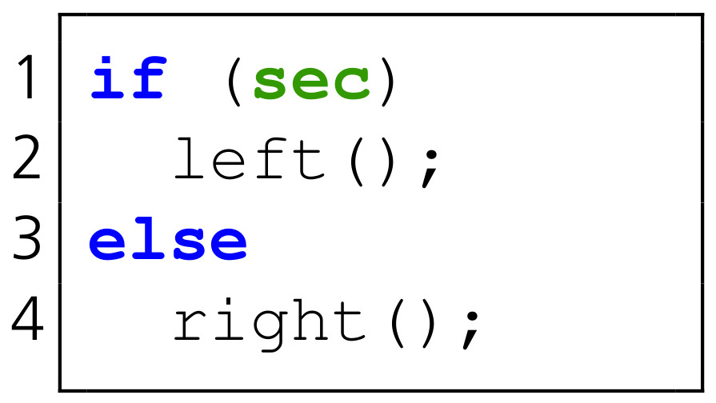

-----------------------------------
Differential Address Trace Analysis
-----------------------------------

DATA ist eine Methodik und ein Framework zum automatisierten Auffinden von Programmcode in sicherheitskritischer Software, der anfällig für Seitenkanal-Angriffe ist.
DATA arbeitet dabei mit der binären Repräsentation eines Programms, so wie es tatsächlich auf Zielsystemen ausgeführt wird.
Der Source-Code wird für die Analyse nicht benötigt, ist jedoch für die Interpretation und für das Beheben gefundener Probleme wichtig.
Die für Seitenkanal-Angriffe anfälligen Instruktionen werden als *Leak* bzw. das Verhalten der Instruktionen als *Leakage* bezeichnet.
DATA findet *adressbasierte* Leaks, also alle Kontrollfluss- und Datenzugriffsoperationen, die abhängig von geheimen Programminputs ausgeführt werden.
Die folgenden zwei Grafiken veranschaulichen dies.

   Leak abhängig vom Datenzugriff.

   Leak abhängig vom Kontrollfluss.

Die Variable *sec* ist dabei geheim, z.B. ein kryptografischer Schlüssel oder ein Passwort.
Die erste Grafik zeigt ein Daten-Leak.
Diese Art von Leak äußert sich in Zugriffen auf Speicherbereiche, z.B. Look-up Tabellen, abhängig von geheimen Daten.
Die zweite Grafik zeigt ein Kontrollfluss-Leak.
Dabei wird die Ausführung abhängig von geheimen Daten verändert und es werden beispielsweise unterschiedliche Funktionen aufgerufen.
Daten-Leaks zeigen sich in je nach Input unterschiedlichen Load-/Store-Adressen.
Kontrollfluss-Leaks zeigen sich in je nach Input unterschiedlichen Sprungadressen und in einer Änderung des Instruktionspointers.

^^^^^^^^^^^^^
Analysephasen
^^^^^^^^^^^^^

Die Analyse mit DATA gliedert sich in drei Phasen, die in der folgenden Grafik dargestellt sind.

   Phasen des DATA Frameworks.

**Phase 1.**
Die erste Phase von DATA detektiert Unterschiede in der Programmausführung für ein gegebenes Zielprogramm.
Dieses Zielprogramm hat zumindest einen Input, der als geheim einzustufen ist.
Für Botan sind dies in der Regel die geheimen kryptografischen Schlüssel.
Das Zielprogramm wird mithilfe eines *Dynamic Binary Instrumentation* (DBI) Frameworks ausgeführt und beobachtet.
In DATA kommt derzeit das DBI Framework *Intel Pin* zum Einsatz [INTEL_PIN]_, für das eine eigene Erweiterung, ein *Pintool*, entwickelt wurde.
Während der Ausführung werden alle Werte des Instruktionspointers und für jede Instruktion alle Adressen, auf die lesend oder schreibend zugegriffen wird, chronologisch mitgeschrieben.
Dieser *Address-Trace* wird für jede Ausführung als Datei abgelegt.
Das Zielprogramm wird in Phase 1 mehrmals mit unterschiedlichen, geheimen Inputs ausgeführt.
Am Ende werden die Address-Traces miteinander verglichen und Unterschiede ermittelt.
Unterschiede bedeuten, dass das Zielprogramm sich für unterschiedliche, geheime Inputs unterschiedlich verhält, sprich unterschiedlichen Code ausführt oder auf unterschiedliche Adressen zugreift.
Derartiges Verhalten ist aus Sicht von Seitenkanal-Angriffen problematisch, da es potentiell Informationen über die geheimen Inputs preisgibt.
Beobachtet man z.B. die Nutzung des Prozessor-Cache eines Programms während der Ausführung, so können sich unterschiedliche, ausgeführte Funktionen in unterschiedlichen, genutzten Regionen des Cache zeigen.
*Constant-time* Implementierungen versuchen daher häufig, die Ausführung unabhängig von Programminputs gleichförmig zu halten.
Alle Unterschiede zwischen den aufgenommenen Address-Traces werden als *Point-of-Interest* (POI) in einer Ergebnisdatei gespeichert und sind die Grundlage für die zweite Phase.

**Phase 2.**
In der zweiten Phase von DATA wird das Zielprogramm erneut im DBI Framework ausgeführt und beobachtet.
Allerdings werden nun nur mehr die Instruktionen und zugehörigen Datenzugriffe mitgeschrieben, die in der ersten Phase als POI identifiziert wurden.
Die Phase 2 hat zum Ziel, unter den POIs echte Leaks zu finden und dafür einen statistischen Nachweis zu liefern.
Dafür kommt eine *Fixed vs. Random*-Testmethodik zum Einsatz, die im Bereich der Seitenkanal-Analyse weit verbreitet ist und dort in der Regel unter den Begriff *Test Vector Leakage Assessment* (TVLA) [TVLA]_ fällt.
Im Gegensatz zu dem für TVLA meist eingesetzten Welch's t-Test, wird in DATA der Kuiper's Test angewendet, da dieser keine Normalverteilungen voraussetzt.
Eine Normalverteilung kann für Verteilungen von zugegriffenen oder ausgeführten Speicheradressen nicht allgemein angenommen werden.
Für den Test werden zwei Gruppen von Ausführungen und zugehöriger Address-Traces erstellt.
Für die erste Gruppe wird das Zielprogramm mit einem fixen, geheimen Input mehrmals ausgeführt.
Für jede Ausführung wird wieder ein Address-Trace angelegt, der zum *Fixed-Set* hinzugefügt wird.
Für die zweite Gruppe wird das Zielprogramm mit mehreren, zufällig gewählten, geheimen Inputs ausgeführt.
Die dabei angelegten Address-Traces bilden das *Random-Set*.
Für jede verdächtige Instruktion, also jeden POI aus Phase 1, ergeben sich dadurch zwei Verteilungen an beobachteten Adressen.
Die erste Verteilung an Adressen basiert auf dem Fixed-Set, die zweite Verteilung auf dem Random-Set.
Können diese beiden Verteilungen unterschieden werden, so ist es prinzipiell möglich, von den beobachteten Adressen auf die geheimen Inputs zu schließen.
Alle Instruktionen, für die diese Unterscheidung möglich ist, stellen ein Seitenkanal-Leak dar und werden in den Berichten von DATA als Problemstelle aufgeführt.

**Phase 3.**
In der dritten Phase von DATA können die erkannten Seitenkanal-Leaks genauer untersucht werden.
Dafür wird anhand von weiterführenden Informationen, z.B. über die Implementierung des untersuchten Algorithmus oder aus der wissenschaftlichen Literatur, ein *Leakage-Modell* gewählt.
Dieses Modell leitet Eigenschaften vom geheimen Input des Zielprogramms ab oder teilt diesen in kleinere Teile auf, die so in der Berechnung des Algorithmus auftreten.
Ein Beispiel eines Leakage-Modells ist das Hamming-Gewicht des geheimen Inputs.
Hat man ein Modell gewählt, werden die Address-Traces des Random-Sets aus Phase 2 oder neu generierte Address-Traces mit zufälligen, geheimen Inputs für die Auswertung herangezogen.
Dabei werden Paare gebildet, bestehend aus dem Leakage-Modell angewendet auf den für einen Trace zugrundeliegenden, geheimen Input und der zugehörigen Adresse eines in Phase 2 erkannten Leaks.
Diese Paare werden über alle vorhandenen Traces gebildet.
Anschließend werden die Paare als Beobachtungen von zwei Zufallsprozessen betrachtet und die gegenseitige Information oder *Mutual Information* zwischen diesen geschätzt.
Dafür kommt der *Randomized Dependence Coefficient* (RDC) [RDC]_ zum Einsatz.
Wird eine Mutual Information festgestellt, so ist es möglich, von den beobachteten Adressen auf die Eigenschaft oder die Teile des geheimen Inputs zu schließen, die mit Hilfe des Leakage-Modells berechnet wurden.
Dadurch kann belegt werden, welche Teile oder Eigenschaften des geheimen Inputs ein Angreifer durch Seitenkanal-Beobachtungen konkret lernen kann.
Das ist ein wichtiger Schritt, um besser zu verstehen, wie kritisch ein Leak ist und welche Informationen im Falle eines Angriffs preisgegeben werden.

**Weitere Informationen.**
Weitere Details zur DATA Methodik finden sich in der wissenschaftlichen Veröffentlichung [DATA]_.
Dort werden beispielsweise die statistischen Tests und die einzelnen Phasen weiter ausgeführt.
Auch praktische Ergebnisse aus der Analyse von kryptografischen Softwarebibliotheken finden sich dort.
Das DATA Framework wird in der Dokumentation auf GitHub [DATA_GIT]_ detaillierter beschrieben.
Es ist modular aufgebaut und kann an vielen Stelle bedarfsgerecht erweitert werden.
Neue Programme oder Softwarebibliotheken können in der Regel einfach hinzugefügt werden.
Die Analyse ist automatisiert und skaliert mit den vorhandenen Rechenkapazitäten.
Die Ergebnisse können automatisiert als Bericht exportiert und in einer grafischen Nutzeroberfläche untersucht werden.

^^^^^^^^^^^^^^^^^^^^^^^^^^^
Interpretation und Hinweise
^^^^^^^^^^^^^^^^^^^^^^^^^^^

Adressbasierte Leaks können durch eine Vielzahl von Seitenkanälen ausgenutzt werden.
In der Mikroarchitektur von Prozessoren können beispielsweise Caches, Übersetzungspuffer oder Vorhersageeinheiten für Sprungadressen Informationen über zugegriffene Adressen preisgeben.
Speicher- und Kohärenzverbindungen zwischen Prozessoren sowie DRAM-Zugriffe können ebenso Ziel von Angriffen sein wie Funktionen des Speichermanagements auf Betriebssystemebene wie Paging oder Speicherdeduplikation.
Da die Angriffsfläche groß und schwer abschätzbar ist, empfiehlt es sich, alle Seitenkanal-Leaks, die in Phase 2 von DATA identifiziert werden, zu beheben.
Dies kann durch eine Veränderung des Codes geschehen, die zur Beseitigung oder zur Abschwächung der Leakage führt.
Leaks können darüber hinaus auch in den Kontext der Verwendung der Software gesetzt werden und in eine Risikobeurteilung einfließen.
Wichtig ist, dass jedes Leak ein potenzielles Problem und einen möglichen Angriffspunkt darstellt.
In den Analyse-Ergebnissen der folgenden Kapitel werden daher alle Leaks beschrieben, die einer Codeänderung oder einer Risikobeurteilung bedürfen.

Die weiteren Absätze in diesem Kapitel gehen auf bestimmte Aspekte der Analyse mit DATA ein und dienen dem Verständnis und der Einordnung der Analyse-Ergebnisse.

**Wertbasierte Leakage.**
Seitenkanal-Angriffe auf Basis des Energieverbrauchs von CMOS-Elektronik werden von DATA nicht abgedeckt.
Diese *wertbasierte* Leakage zeichnet sich dadurch aus, dass der Stromverbrauch und in weiterer Folge die elektromagnetische Abstrahlung abhängig von den in der Hardware verarbeiteten Daten sind.
Unterschiedliche Daten erzeugen dabei unterschiedliche Profile in den Messungen, was wiederum die Inferenz von Informationen über verarbeitete Daten ermöglicht.
Mit DATA gibt es nur dahingehend eine Überschneidung, dass gravierende Abhängigkeiten der Ausführung von geheimen Inputs erwartungsgemäß auch in derartigen Messungen sichtbar sind.
Das können beispielsweise stark variierende Ausführungszeiten sein.

**Aussage der Analyse.**
Der Ansatz von DATA hat die inhärente Eigenschaft, dass Seitenkanal-Leaks zwar mit einer gegebenen Konfidenz gefunden werden können, deren Existenz aber nicht grundsätzlich ausgeschlossen werden kann.
Werden mit Hilfe von DATA Leaks gefunden, so liegt dem eine statistisch beweisbare Abhängigkeit zugrunde, die die Angreifbarkeit des Codes belegt.
Falsch-positive Ergebnisse werden durch den Testansatz in DATA weitestgehend vermieden.
Werden keine Leaks gefunden, bedeutet dies nur, dass mit den verwendeten Analyse-Parametern keine Leaks gefunden werden konnten, und nicht, dass generell keine Leaks existieren.
Das bedeutet, dass falsch-negative Ergebnisse durchaus möglich sind.
Das betrifft insbesondere die Anzahl an Programmausführungen und zugehöriger Address-Traces, die die Basis für die Analysen bilden.
Je weniger Ausführungen beobachtet werden, desto wahrscheinlicher sind falsch-negative Ergebnisse. 
Eine hohe Anzahl an Ausführungen bzw. Traces hat demzufolge zwei maßgebliche Wirkungen.
Einerseits führen mehr Beobachtungen zu deutlicheren Ergebnissen in den statistischen Tests, wenn Leaks erkannt werden.
Andererseits ist die Anzahl der Traces auch eine Maßzahl des Aufwands, den ein Angreifer in die Beobachtung eines Programms in der Praxis investieren muss.
Je größer die Anzahl, desto größer der Aufwand.
Werden mit einer bestimmten Anzahl an Traces keine Leaks gefunden, so würde auch ein Angreifer auf Basis derselben Beobachtungen keine statistisch relevante Information lernen.

**Analyse-Ergebnisse.**
Die Ergebnisse von DATA zeigen präzise, welcher Code Abhängigkeiten von geheimen Inputs aufweist und unbedingt betrachtet werden muss.
Das kann erheblichen Aufwand sparen, der dafür z.B. im Rahmen eines manuellen Code-Reviews investiert werden müsste.
Die Ergebnisse zeigen jedoch nicht, wie und mit welchem Erfolg man eine bestimmte Stelle im Code ausnutzen oder angreifen kann.
Daher ist es für identifizierte Leaks in der Regel notwendig, den Ursprung der Abhängigkeit zu verstehen und den Leak zu bewerten.
Die in diesem Bericht aufgeführten Leaks und die zugrundeliegenden Probleme wurden bereits in dieser Art analysiert und bewertet.

**Vergleich zu bestehenden Tools.**
Für die Entwicklung von Botan werden momentan zwei Ansätze verwendet, um die Anfälligkeit des Codes für Seitenkanal-Angriffe einzuschätzen.
Angelehnt an *ctgrind* von Adam Langley [CT_GRIND]_ ist es in Botan möglich, geheime Programm- bzw. Funktionsinputs als *uninitialisiert* zu markieren [BOTAN_CT_UTILS]_.
Das Valgrind Tool *Memcheck* [VALGRIND_MEMCHECK]_ wird dann verwendet, um Warnungen auszugeben, wenn diese uninitialisierten Inputs für Datenzugriffs- oder Kontrollflussoperation verwendet werden.
Dieser Ansatz erlaubt es, Daten- und Kontrollfluss-Leaks präzise zu finden, benötigt im Gegensatz zu DATA aber Annotationen des Source-Codes.
Weiters werden mehr falsch-positive Ergebnisse erzeugt, da uninitialisierte Werte auch in Gegenmaßnahmen gegen Seitenkanal-Angriffe, wie z.B. *Exponent Blinding*, propagieren.
In DATA wird dies automatisch herausgefiltert, sofern die Gegenmaßnahmen den gewünschten Effekt erzielen.
Darüber hinaus können, im Gegensatz zur DATA Phase 3, mit diesem Ansatz keine konkreten Zusammenhänge zwischen Datenzugriff oder Kontrollfluss und geheimen Inputs bestimmt werden.
Ein weiterer Testansatz bei der Entwicklung von Botan ist das Tool *timing_tests* [BOTAN_TIMING_TEST]_.
Es ruft bestimmte Funktionen innerhalb von Botan mit unterschiedlichen, geheimen Inputs auf, misst die Ausführungszeiten und schreibt diese in eine Datei.
Die gemessenen Zeiten werden im Anschluss mit Hilfe des *Mona Timing Report* Tools visuell ausgewertet [MONA_TIMING]_.
Im Gegensatz zu DATA liefert dieser Ansatz keinen statistischen Nachweis von Abhängigkeiten der Programmausführung von geheimen Programm- oder Funktionsinputs.

**Hinweis:** Für die automatisierten Seitenkanal-Analysen in diesem Prüfbericht kommen das an *ctgrind* angelehnte Analyse-Tool sowie DATA zum Einsatz.
DATA ist dabei der Ersatz für die Tools *timing_tests* und *Mona Timing Report*.

