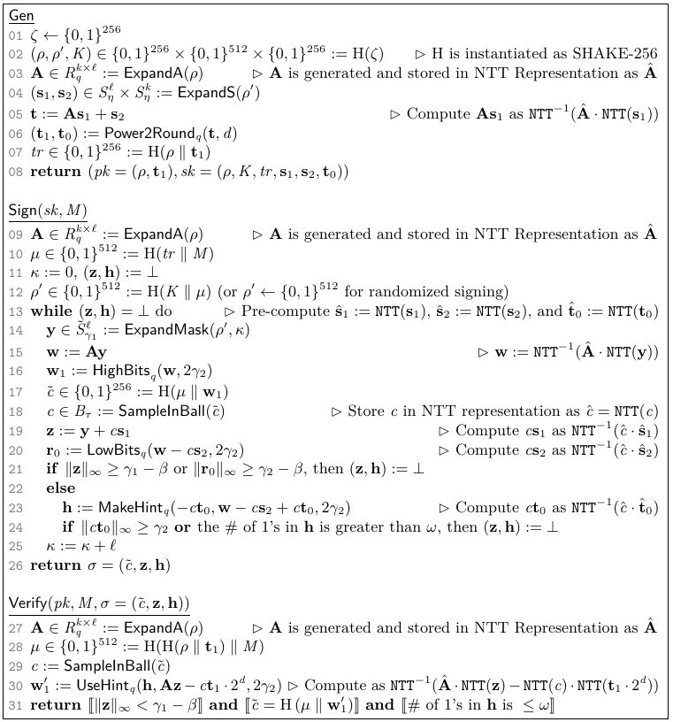

""""""""""""""""""
CRYSTALS-Dilithium
""""""""""""""""""

Analysierte Variante:

- 4x4

Für die Analyse von Dilithium wurde ein Hilfsprogramm geschrieben, das ähnlich wie das Botan CLI die zu analysierenden Funktionen aufruft.
Die Signatur wird im deterministischen Modus erstellt.
Für die Erzeugung der Signatur wird folgender Aufruf verwendet:

.. code-block:: cpp

    Botan::Dilithium_PrivateKey priv_key(priv_key_bits, mode, encoding);

    Botan::PK_Signer sig(priv_key, rng, "Deterministic");
    signature = sig.sign_message(message, rng);

Die Analyse mit DATA zeigt in sieben Funktionen Unterschiede in der Ausführung des Algorithmus.
Dafür wurden in Phase 1 dieselbe Nachricht und unterschiedliche Schlüsselpaare verwendet.
Die sieben Funktionen lassen sich in vier Kategorien zusammenfassen:

  1) die Berechnung der Hinweise einer Signatur
  2) die Erzeugung von *c_tilde*
  3) die Unendlichkeitsnorm von *r_0*
  4) die Erzeugung der Polynommatrix *A*

Als Referenz ist nachfolgend der :ref:`Pseudocode von Dilithium <dilithium_sc/pseudocode>` angeführt.
Der deterministische Modus unterscheidet sich vom randomisierten Modus nur durch die Wahl von *ρ'* in Zeile 12.
Das berechnete oder zufällig gewählte *ρ'* wird anschließend in der Funktion `ExpandMask()`, in Zeile 14, verwendet.
Für diesen Schritt des Algorithmus wurde in der Analyse kein Leak identifiziert.
Die Wahl von *ρ'* hat daher keinen weiteren Einfluss auf die Analyse, für die ausschließlich der deterministische Modus verwendet wurde.

.. _dilithium_sc/pseudocode:

   Dilithium Pseudocode [DILITHIUM_SPECIFICATION]_.

**Leak: Hinweise**

In der Analyse mit DATA wurden Leaks in den Funktionen `generate_hint_polynomial()` [BOTAN_DILITHIUM_GENERATE_HINT_POLYNOMIAL]_, `make_hint()` [BOTAN_DILITHIUM_MAKE_HINT]_, und `pack_sig()` [BOTAN_DILITHIUM_PACK_SIG]_ detektiert.

Die Funktionen `generate_hint_polynomial()` und `make_hint()` erzeugen Hinweise zur Verifikation der Signatur.
Die Funktion `pack_sig()` fügt diese Hinweise der Signatur hinzu.
Dies entspricht im Pseudocode der Funktion `MakeHint()` in Zeile 23.
Falls die Signatur nicht verworfen wird, werden diese Hinweise zu einem Teil der Signatur und sind somit öffentlich bekannt.
Bei Signaturen, die verworfen werden, ermöglicht das Wissen über die Hinweise nach derzeitigem Kenntnisstand keinen Angriff auf den privaten Schlüssel oder die zu signierende Nachricht.
Aus diesen Gründen sind die gefundenen Leaks der Hinweise als unproblematisch einzustufen.

**Leak: c_tilde**

Bei der Generierung von *c_tilde* wurden in der Funktion `poly_challenge()` Leaks identifiziert [BOTAN_DILITHIUM_POLY_CHALLENGE]_.
Die Funktion entspricht im Pseudocode der Funktion `SampleInBall()` in Zeile 18.
*c_tilde* wird der Signatur hinzugefügt, ist somit öffentlich bekannt und erlaubt es, dass die Funktion `SampleInBall()` auch während der Verifikation ausgeführt werden kann.
Aus diesem Grund sind die gefundenen Leaks während der Generierung von *c_tilde* als unproblematisch einzustufen.

**Leak: Überprüfung des Grenzwerts für r_0**

Für die Funktionen `polyvec_chknorm()` [BOTAN_DILITHIUM_POLYVEC_CHKNORM]_ und `poly_chknorm()` [BOTAN_DILITHIUM_POLY_CHKNORM]_ wurden Leaks identifiziert.
Die Funktion `polyvec_chknorm()` iteriert über jedes Polynom und die Funktion `poly_chknorm()` prüft, ob die Unendlichkeitsnorm des gegebenen Polynoms strikt kleiner als der angegebene Grenzwert ist.
DATA hat dabei einen Kontrollfluss-Leak für die folgende Bedingung festgestellt:

.. code-block:: cpp

    if(std::get<1>(w1_w0).polyvec_chknorm(mode.gamma2() - mode.beta()))
      {
      continue;
      }

Diese Bedingung findet sich in Zeile 21 des Pseudocodes und ist Teil der Funktion `sign()` in Botan [BOTAN_DILITHIUM_INFINITYNORM]_.
Ist die Bedingung erfüllt, wird die erzeugte Signatur verworfen und der Prozess beginnt von neuem.
Die gefundenen Leaks können es ermöglichen, dass Angreifer das Wissen erlangen, welches der Polynome ein Verwerfen der Signatur zur Folge hat.
Nach derzeitigem Kenntnisstand ermöglicht dieses Wissen keinen Angriff auf den privaten Schlüssel oder die zu signierende Nachricht.

Zur Überprüfung der Unendlichkeitsnorm wird in der Implementierung der Absolutwert jedes Terms mit dem Grenzwert verglichen.
Der Referenz-Implementierung von CRYSTALS-Dilithium [DILITHIUM_REFERENCE_IMPLEMENTATION]_ kann entnommen werden, dass das Element, das diese Bedingung erfüllt und damit zum Verwerfen einer Signatur führt, bekannt sein darf, nicht aber das Vorzeichen des Elements:

.. code-block:: c

  /* It is ok to leak which coefficient violates the bound since
     the probability for each coefficient is independent of secret
     data but we must not leak the sign of the centralized representative. */
  for(i = 0; i < N; ++i) {
    /* Absolute value */
    t = a->coeffs[i] >> 31;
    t = a->coeffs[i] - (t & 2*a->coeffs[i]);

Die aktuelle Implementierung in der Funktion `poly_chknorm()` in Botan erfüllt diese Vorgabe.
Das Vorzeichen kann den gefundenen Leaks nicht entnommen werden, wie der folgende Code-Ausschnitt zeigt.

.. code-block:: cpp

  for(const auto& coeff : a.m_coeffs)
    {
    /* Absolute value */
    size_t t = coeff >> 31;
    t = coeff - (t & 2 * coeff);
    if(t >= B)
      {
      return true;
      }
    }

Aus diesen Gründen sind die gefundenen Leaks als unproblematisch einzustufen.

**Leak: Polynommatrix A**

In der Funktion `generate_matrix()` [BOTAN_DILITHIUM_GENERATE_MATRIX]_ wurden ebenfalls Leaks identifiziert.
Die Funktion entspricht im Pseudocode der Funktion `ExpandA()` in Zeile 9.
Die Inputvariable *ρ* ist sowohl im privaten als auch im öffentlichen Schlüssel enthalten.
Diese Operation wird sowohl bei der Signaturerstellung als auch bei der Signaturprüfung durchgeführt.
Daher sind die gefundenen Leaks als unproblematisch einzustufen.

